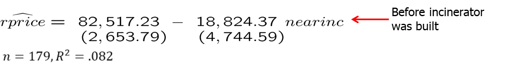
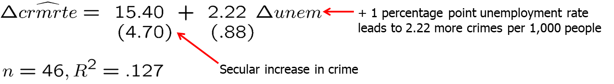
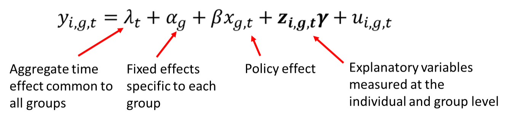

```{r setup, include=FALSE}
options(htmltools.dir.version = FALSE) 
knitr::opts_chunk$set(echo = FALSE, warning = FALSE, message = FALSE, fig.width = 8, fig.height = 6)
library(tidyverse)
library(gghighlight)
library(jtools)
library (wooldridge) # need to load the package before using it
library(fixest) # needed to run the regression feols
library(modelsummary)
library(magrittr)
library(stargazer)

```


``` {r xaringan-themer, include=FALSE, warning=FALSE}
# install.packages("remotes")
#remotes::install_github('rstudio/chromote')
#remotes::install_github("jhelvy/xaringanBuilder")

library(xaringanBuilder)
library(xaringanthemer)
style_duo_accent(
 # primary_color = "#1381B0",
  primary_color = "#006600", # color first slide and titles
  secondary_color = "#FF961C",
  inverse_header_color = "#FFFFFF"  #white
)

#this to build PDF :)
#build_pdf('https://github.com/andrahiriscau/Econometrics_Slides/blob/main/Lecture_1/Econometrics.html')
#build_pdf('https://andrahiriscau.github.io/Econometrics_Slides/Chapter_2/Chapter_2.html')


```

### Outline


---
### 13.1 Policy analysis with pooled cross sections

Two or more independently sampled cross sections can be used to evaluate the impact of a certain event or policy change.

Example: Effect of new garbage incinerator’s location on housing prices.

Examine the effect of the location of a house on its price before and after the garbage incinerator was built:


```{r, out.width="500px", fig.align = 'center'}


```

```{r, out.width="500px", fig.align = 'center'}


```


---

Example: Garbage incinerator and housing prices

- It would be wrong to conclude from the regression after the incinerator is there that being near the incinerator depresses prices so strongly.
- One has to compare with the situation before the incinerator was built:


$\widehat{\delta}_{1}=-30,688.27-(-18,824.37)=-11,863.9$

--

Incinerator depresses prices but location was one with lower prices anyway

In the given case, this is equivalent to:


$\hat{\delta}_{1}=\left(\overline{\text { rprice }}_{1, n r}-\overline{\text { rprice }}_{1, f r}\right)-\left(\overline{\text { rprice }}_{0, n r}-\overline{r p r i c e}_{0, f r}\right)$


**This is called the difference-in-differences estimator (DiD)**


---

### Difference-in-differences in a regression framework

$$rprice =\beta_{0}+\delta_{0} after+\beta_{1}nearinc+\delta_{1} after *nearinc $+u$$

  $\delta_1$:  differential effect of being in the location AND after the incinerator was built


- In this way standard errors for the DiD-effect can be obtained.

- If houses sold before and after the incinerator was built were systematically different, further explanatory variables should be included.

- This will also reduce the error variance and thus standard errors.

- Before/After comparisons in “natural experiments”

- DiD can be used to evaluate policy changes or other exogenous events.


---

### Policy evaluation using difference-in-differences

$y=\beta_{0}+\delta_{0} a$ fter $+\beta_{1}$ treated $+\delta_{1}$ after treated $+$ other factors

Compare outcomes of the two groups before and after the policy change:

$\hat{\delta}_{1}=\left(\bar{y}_{1, T}-\bar{y}_{1, C}\right)-\left(\bar{y}_{0, T}-\bar{y}_{0, C}\right)$


- Compare the difference in outcomes of the units that are affected by the policy change (= treatment group) and those who are not affected (= control group) before and after the policy was enacted.

- For example, the level of unemployment benefits is cut but only for group A (= treatment group). Group A normally has longer unemployment duration than group B (= control group). If the difference in unemployment duration between group A and group B becomes smaller after the reform, reducing unemployment benefits reduces unemployment duration for those affected.

 - Caution: Difference-in-differences only works if the difference in outcomes between the two groups is not changed by other factors than the policy change (e.g. there must be no differential trends).

---

## 13.3 Two-period panel data analysis

Example: Effect of unemployment on city crime rate


- Assume that no other explanatory variables are available. Will it be possible to estimate the causal effect of unemployment on crime?

- Yes, if cities are observed for at least two periods and other factors affecting crime stay approximately constant over those periods:

```{r, out.width="500px", fig.align = 'center'}


```


---


$$\begin{aligned} \text { crmrte }_{i 1987} &=\beta_{0}+\delta_{0} \cdot 1+\beta_{1} \text { unem }_{i 1987}+a_{i}+u_{i 1987} \\ \text { crmrte }_{i 1982} &=\beta_{0}+\delta_{0} \cdot 0+\beta_{1} \text { unem }_{i 1982}+a_{i}+u_{i 1982} \\ \text { Subtract: } \Rightarrow \text { drmrte } &=\delta_{0}+\beta_{1} \Delta \text { unem }_{i}+\Delta u_{i} \longleftarrow \text { Fixed effect drops out } \end{aligned}$$
Estimate differenced equation by OLS:


```{r, out.width="500px", fig.align = 'center'}


```


---

### Discussion of first-differenced panel estimator

Further explanatory variables may be included in original equation.

Note that there may be arbitrary correlation between the unobserved time-invariant characteristics and the included explanatory variables.
OLS in the original equation would therefore be inconsistent.
The first-differenced panel estimator is thus a way to consistently estimate causal effects in the presence of time-invariant endogeneity.

For consistency, strict exogeneity has to hold in the original equation.
First-differenced estimates will be imprecise if explanatory variables vary only little over time (no estimate possible if time-invariant).


---

### Another interpretation of the difference-in-differences estimator


We can re-write the DiD estimator as:


$\hat{\delta}_{1}=\left(\bar{y}_{1, T}-\bar{y}_{0, T}\right)-\left(\bar{y}_{1, C}-\bar{y}_{0, C}\right)$


The first term is the difference in means over time for the treated group 
This would be a good estimator of the policy effect only if no external factors changed across the two time periods.
The second term is the difference in means over time for the control group.
Subtracting off this term hopefully controls for any changes in external factors that are common to both the treated and control groups, which will be the case when we have random assignment.
In this case, the DiD estimator can be interpreted as the average treatment effect.


---


### Adding an additional control group

The standard two-group, two period difference-in-differences setup relies on the assumption of parallel trends.
Parallel trends assumes that any trends in the outcome y would trend at the same rate in the absence of the intervention. 
Prior to the intervention, y should move in the same direction for both groups.
The standard DiD estimator measures the difference in estimated trends between the two groups. 
If the parallel trends assumption is violated, we cannot be sure that the DiD estimator is identifying the effects of the policy or simply some other unaccounted factor causing different trends between these groups.
We can add flexibility by adding an additional control group.


---
### Adding an additional control group

Example: The effects of expanding health care for low income families in a particular state.
Let L denote low-income families (eligible for the policy) and M be middle-income families (not eligible).
Let B denote states that implemented the policy and A be states that did not implement the policy.
The policy is implemented in period 1 , but no policy exists in period 0.

The additional control group (income level) allows for more flexibility if we assume that any difference in trends in health outcomes between low and middle income families is similar across states.


---
### Adding an additional control group

$y=\beta_{0}+\beta_{1} d L+\beta_{2} d B+\beta_{3} d L * d B+\delta_{0} d 1+\delta_{1} d 1 * d L+\delta_{2} d 1 * d B+\delta_{3} d 1 * d L * d B+u$
$\hat{\delta}_{3}=\left[\left(\bar{y}_{1, L, B}-\bar{y}_{0, L, B}\right)-\left(\bar{y}_{1, M, B}-\bar{y}_{0, M, B}\right)\right]-\left[\left(\bar{y}_{1, L, A}-\bar{y}_{0, L, A}\right)-\left(\bar{y}_{1, M, A}-\bar{y}_{0, M, A}\right)\right]$
$\hat{\delta}_{3}=\hat{\delta}_{D D, B}-\hat{\delta}_{D D, A}=\hat{\delta}_{D D D}$

The difference-in-difference-in differences estimator has two components
A DD estimator looking only at states that implemented the policy.
A DD estimator looking only at states that did not implement the policy.
If health trends between the L and M groups do not differ in non-implementation states, then the second component vanishes and we are back to the standard DiD setup. 
However, we include this second term to account for possibly different trends in the L and M groups that are common across both states A and B.


---
## A General Framework for Policy Analysis

A more general approach to policy analysis is to include multiple control and treatment groups as well as more than two time periods. 
Some units may never be treated and others may be treated in different time periods.
With this general framework, we should avoid trying to fit the problem into the basic DD setup.
Let each observation i belong to a pair (g, t) , where g is a group and t is a time period.
We are interested in policy interventions that occur at the group level and in order to be convincing, there should be before and after periods for at least some of the groups in our study.

---
### A General Framework for Policy Analysis


Indicate the policy with a dummy variable $x_{g,t}$ for group $g$ and time $t$


```{r, out.width="500px", fig.align = 'center'}


```


This model can be expanded upon with the addition of lagged policy effects or allowing the policy to have different effects between groups.
