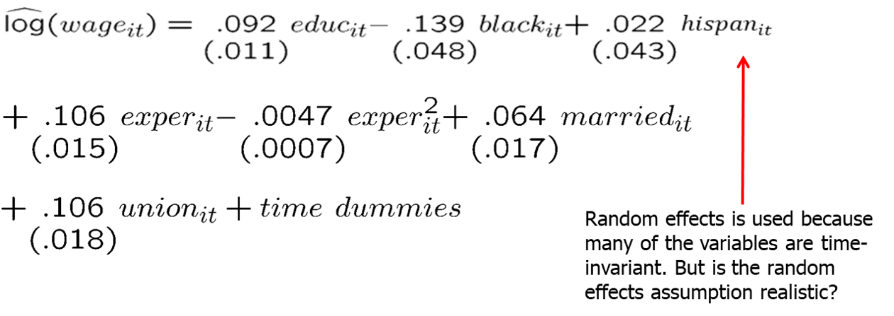

```{r setup, include=FALSE}
options(htmltools.dir.version = FALSE) 
knitr::opts_chunk$set(echo = FALSE, warning = FALSE, message = FALSE, fig.width = 8, fig.height = 6)
library(tidyverse)
library(gghighlight)
library(jtools)
library (wooldridge) # need to load the package before using it
library(fixest) # needed to run the regression feols
library(modelsummary)
library(magrittr)
library(stargazer)
library(plm)


```


``` {r xaringan-themer, include=FALSE, warning=FALSE}
# install.packages("remotes")
#remotes::install_github('rstudio/chromote')
#remotes::install_github("jhelvy/xaringanBuilder")

library(xaringanBuilder)
library(xaringanthemer)
style_duo_accent(
 # primary_color = "#1381B0",
  primary_color = "#006600", # color first slide and titles
  secondary_color = "#FF961C",
  inverse_header_color = "#FFFFFF"  #white
)

#this to build PDF :)
#build_pdf('https://github.com/andrahiriscau/Econometrics_Slides/blob/main/Lecture_1/Econometrics.html')
#build_pdf('https://andrahiriscau.github.io/Econometrics_Slides/Chapter_2/Chapter_2.html')

library(xaringanBuilder) 
build_pdf("Chapter_14.html")


```

### Outline

Fixed effects
  - Intuition
  - Assumptions
  - Properties
  - Fixed effects or first difference?

Random effects
  - Assumption

Hausman test

Applying panel data methods to other data structures


---
### Introduction

We will want to estimate the parameters of the model:

$$y_{i t}=\beta_{0}+\beta_{1} x_{1 i t}+\beta_{2} x_{2 i t}+\ldots+a_{i}+u_{i t}$$
We will see two aditional methods:
 
  1) Fixed effects: Differences $a_i$ away
  
  2) Random effects: Puts $a_i$ into the error term
  
  
  
---
### Fixed Effects (FE)

$$y_{i t}=\beta_{1} x_{i t 1}+\ldots+\beta_{k} x_{i t k}+a_{i}+u_{i t}$$

  - $a_i$ fixed effect (does not change over time), potentially correlated with explanatory variables
  
--

Form time-averages for each individual

$$\bar{y}_{i}=\beta_{1} \bar{x}_{i 1}+\ldots+\beta_{k} \bar{x}_{i k}+\bar{a}_{i}+\bar{u}_{i}$$
$$\left[y_{i t}-\bar{y}_{i}\right]=\beta_{1}\left[x_{i t 1}-\bar{x}_{i 1}\right]+\ldots+\beta_{k}\left[x_{i t k}-\bar{x}_{i k}\right]+\left[u_{i t}-\bar{u}_{i}\right]$$
 - Because $a_{i}-\bar{a}_{i}=0$ (the fixed effect is removed)
 
 
Estimate time-demeaned equation by OLS
  - Uses time variation within cross-sectional units (= within estimator)

 
---
### Fixed Effects

This is equivalent to a two steps process:

1) Average equation across each cross section $i$:

$$\bar{y}_{i}=\beta_{0}+\beta_{1} \bar{x}_{1 i}+\beta_{2} \bar{x}_{2 i}+\ldots+\bar{u}_{i}$$

2) Subtract average from each observation:

$$y_{i t}-\bar{y}_{i}=\beta_{1}\left(x_{1 i t}-\bar{x}_{1 i}\right)+\beta_{2}\left(x_{2 i t}-\bar{x}_{2 i}\right)+\ldots+u_{i t}-\bar{u}_{i}$$

This process is called **time demeaning** or **within transformation**.

The resulting model above is usually written as:

$$\ddot{y}_{i t}=\beta_{1} \ddot{x}_{1 i t}+\beta_{2} \ddot{x}_{2 i t}+\ldots+\ddot{u}_{i t}$$

---

### Fixed effects using dummy variables

The fixed effects estimator is equivalent to introducing a dummy for each individual in the original regression and using pooled OLS:


$$\begin{aligned} y_{i t}=& a_{1} i n d 1_{i t}+a_{2} i n d 2_{i t}+\ldots+a_{N} i n d N_{i t} +\beta_{1} x_{i t 1}+\ldots+\beta_{k} x_{i t k}+u_{i t} \end{aligned}$$
  - where $i n d 1_{i t}$ is 1 if observation stems from first individual and 0 otherwise


--

After fixed effects estimation, the fixed effects can be estimated as:


$$\hat{a}_{i}=\bar{y}_{i}-\widehat{\beta}_{1} \bar{x}_{i 1}-\ldots-\widehat{\beta}_{k} \bar{x}_{i k}$$


---

## Fixed Effects Assumptions


The applicability of FE depends on a series of assumptions:
- **Strict exogeneity of all $\mathbf{x}$** : Same as in first differences (FD), the error term must not have an effect on future realizations of any $x$.

--

- **Error terms serially uncorrelated**: This is also a strong assumption, meaning that $u_{i t}$ has no influence on $u_{i t+1}$. Remember that the error term includes unobserved variables that change over time, but also that their fixed component is included in $a_{i}$.

--

- **Error term has to be homoskedastic**.


---
## Fixed Effects Properties

The FE estimator has similar properties to those of FD:

--

- All time constant variables are eliminated.

--

- Cross sectional variance is eliminated, need for sufficient variance in changes over time.

--

- Time constant variables can still be interacted with variables that change over time (e.g. year dummies).

--

- If a full set of year dummies is included, one **cannot estimate** the effect of any variable whose change across time is constant (e.g. experience, age).


---
### Example: Effect of training grants on firm scrap rate

$$scrap_{it}=\beta_{1} d 88_{it}+\beta_{2} d 89_{it}+\beta_{3} grant_{i t}+\beta_{4} grant_{i t-1}+a_{i}+u_{i t}$$
  - Time-invariant reasons why one firm is more productive than another are controlled for.

  - The important point is that these may be correlated with the other explanatory variables.


Fixed-effects estimation using the years 1987, 1988, and 1989:


```{r, out.width="600px", fig.align = 'center'}


```


Note: Scrap rate is a percentage of failed materials that cannot be restored or repaired and is discarded.


---
### Fixed Effects of First Difference?

The two estimators are very similar. The most important results are:


- When $T=2$ the two estimators are exactly identical! But FD is computationally easier.

- When $\mathrm{T}>2$ the following observations are important:
    - When the $u_{i t}$ are serially uncorrelated $\Rightarrow$ $\mathrm{FE}$ is preferred.
    - When the $\Delta u_{i t}$ are serially uncorrelated $\Rightarrow$ FD is preferred.
    - Bias induced by measurement error or a violation of the strict exogeneity assumption may decreases with $\mathrm{T}$ in $\mathrm{FE}$, but not $\mathrm{FD}$.


---
### Discussion of Fixed Effects estimator

- Strict exogeneity in the original model has to be assumed.
- The $R^2$ of the demeaned equation is inappropriate.
- The effect of time-invariant variables cannot be estimated.
- The effect of interactions with time-invariant variables can be estimated (e.g. the interaction of education with time dummies).
- If a full set of time dummies are included, the effect of variables whose change over time is constant cannot be estimated (e.g. experience).
- Degrees of freedom have to be adjusted because the N time averages are estimated in addition (resulting degrees of freedom = NT-N-k).


---
### Unbalanced panels

An unbalanced panel is when not all cross-sectional units have the same number of observations.
  - Dropping units with only one time period does not cause bias or inconsistency.


*Fixed effects (FE) or First Differencing (FD) with unbalanced panels*
    
  - FE will preserve more data than FD when we have unbalanced panels, since FD requires that each observation have data available for both t and t-1.
  - For example, consider a scenario in which we have seven years of data, but data is missing for all even numbered years. Thus, we observe t=1,3,5,7. 

      - FE will use time periods 1,3,5,7 

      - FD will lose all observations.


---
## Random Effects (RE)

The crucial assumption in RE is that all the $x_{i t}$ are uncorrelated with $a_{i}$ :

$$\operatorname{cov}\left(x_{j t i}, a_{i}\right)=0 ~~~~~~ \forall~~~ j$$

If this is the case $a_{i}$ can simply be put into the error term:

$$\nu_{i t}=a_{i}+u_{i t}$$

Since $a_{i}$ is constant across $t$ the composite error term $\nu_{i t}$ is serially correlated across time!

This model has to be estimated by Generalized Least Squares (GLS)


---
## Random Effects (RE) models

$y_{i t}=\beta_{0}+\beta_{1} x_{i t 1}+\cdots+\beta_{k} x_{i t k}+a_{i}+u_{i t}$

 - The individual effect $a_i$ is assumed to be "random" (i.e. completely unrelated to explanatory variables)
 
 
 **Random effects assumption:** 
  
   $$\operatorname{Cov}\left(x_{i t j}, a_{i}\right)=0, j=1,2, \ldots, k$$
 
 The composite error $a_i$ + $u_{it}$ is uncorrelated with the explanatory variables but it is serially correlated for observations coming from the same $i$:

 
 For example, in a wage equation, for a given individual the same unobserved ability appears in the error term of each period. Error terms are thus correlated across periods for this individual.
 
 $$\operatorname{Cov}\left(a_{i}+u_{i t}, a_{i}+u_{i s}\right)=\operatorname{Cov}\left(a_{i}, a_{i}\right)=\sigma_{a}^{2}$$
 
 
---
### Example: Wage equation using panel data

 
```{r, out.width="600px", fig.align = 'center'}

```


 Random effects or fixed effects?

  - In economics, unobserved individual effects are seldomly uncorrelated with explanatory variables so that fixed effects is more convincing.


---
### Hausman test

One can use FE and RE, and then formally test for statistically significant differences in the coefficients on the time varying explanatory variables

  - If the Hausman test statistic  is *not significantly different* from zero, then both the FE and RE estimators are consistent. RE estimator should be used because it is more efficient.
  
  - If the Hausman test statistic is *significantly different* from zero, then only the FE estimator is consistent and should be used.
  
  
  
---

```{r,echo=TRUE,eval=FALSE}
library(plm)
data(jtrain)
# Fixed effects within estimator using plm package
model_fe <- plm(formula = lscrap ~ tothrs + d88 + d89 + grant + grant_1, 
              data = jtrain, 
              index = c("fcode", "year"), # c(group index, time index)
              model = "within", effect = "individual") 

# Fixed effects within estimator using feols package
model_fe_2<-feols( lscrap ~ tothrs + d88 + d89 + grant + grant_1 | year + fcode , data = jtrain)

# summary
msummary(list(model_fe,model_fe_2), stars = TRUE)

              
```  
 
 
  
---

```{r,echo=FALSE,eval=TRUE}
library(plm)
data(jtrain)
# Fixed effects within estimator using plm package
model_fe <- plm(formula = lscrap ~ tothrs + d88 + d89 + grant + grant_1, 
              data = jtrain, 
              index = c("fcode", "year"), # c(group index, time index)
              model = "within", effect = "individual") 

# Fixed effects within estimator using feols package
model_fe_2<-feols( lscrap ~ tothrs + d88 + d89 + grant + grant_1 | year + fcode , data = jtrain)

# summary
msummary(list(model_fe,model_fe_2), stars = TRUE)

              
```   
 
  
---

```{r,echo=TRUE,eval=FALSE}

# Random effects estimator
# model_re <- update(model_ols, model = "random", random.method = "walhus")
model_re <- plm(formula = lscrap ~ tothrs + d88 + d89 + grant + grant_1, 
              data = jtrain, 
              index = c("fcode", "year"), # c(group index, time index)
              model = "random", random.method = "walhus")  
summary(model_re)

              
```

---

```{r,echo=FALSE,eval=TRUE}

# Random effects estimator
# model_re <- update(model_ols, model = "random", random.method = "walhus")
model_re <- plm(formula = lscrap ~ tothrs + d88 + d89 + grant + grant_1, 
              data = jtrain, 
              index = c("fcode", "year"), # c(group index, time index)
              model = "random", random.method = "walhus")  

msummary(model_re,stars=TRUE)

              
```


---
### Hausman test

```{r,echo=TRUE,eval=FALSE}

# The Hausman test is used to decide whether to use fixed effects or random effects.
# H0: FE coefficients are not significantly different from the RE coefficients
# Ha: FE coefficients are significantly different from the RE coefficients

# Hausman test for fixed versus random effects
phtest(model_fe, model_re)

```

---
### Hausman test

```{r,echo=FALSE,eval=TRUE}

# The Hausman test is used to decide whether to use fixed effects or random effects.
# H0: FE coefficients are not significantly different from the RE coefficients
# Ha: FE coefficients are significantly different from the RE coefficients

# Hausman test for fixed versus random effects
phtest(model_fe, model_re)

```


