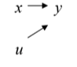
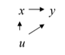
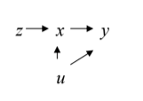
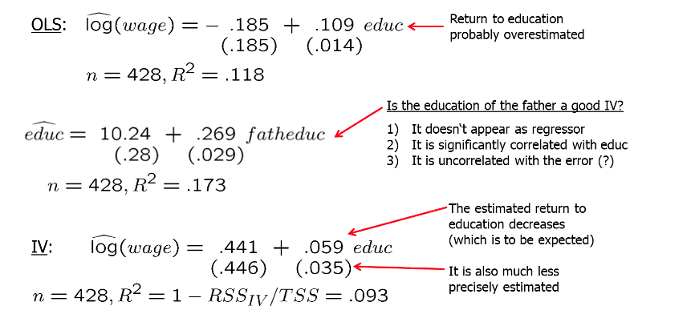
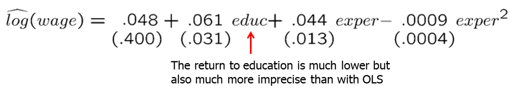

```{r setup, include=FALSE}
options(htmltools.dir.version = FALSE) 
knitr::opts_chunk$set(echo = FALSE, warning = FALSE, message = FALSE, fig.width = 8, fig.height = 6)
library(tidyverse)
library(gghighlight)
library(jtools)
library (wooldridge) # need to load the package before using it
library(fixest) # needed to run the regression feols
library(modelsummary)
library(magrittr)
library(stargazer)

library(AER)
library(tidyverse)
library(gganimate)
library(estimatr)
library(magick)
library(dagitty)
library(ggthemes)
library(directlabels)
library(ggdag)
library(fixest)
library(jtools)
library(scales)
#library(Cairo)
theme_metro <- function(x) {
  theme_classic() + 
  theme(panel.background = element_rect(color = '#FAFAFA',fill='#FAFAFA'),
        plot.background = element_rect(color = '#FAFAFA',fill='#FAFAFA'),
        text = element_text(size = 16),
        axis.title.x = element_text(hjust = 1),
        axis.title.y = element_text(hjust = 1, angle = 0))
}
theme_void_metro <- function(x) {
  theme_void() + 
  theme(panel.background = element_rect(color = '#FAFAFA',fill='#FAFAFA'),
        plot.background = element_rect(color = '#FAFAFA',fill='#FAFAFA'),
        text = element_text(size = 16))
}
theme_metro_regtitle <- function(x) {
  theme_classic() + 
  theme(panel.background = element_rect(color = '#FAFAFA',fill='#FAFAFA'),
        plot.background = element_rect(color = '#FAFAFA',fill='#FAFAFA'),
        text = element_text(size = 16))
}

```


``` {r xaringan-themer, include=FALSE, warning=FALSE}
# install.packages("remotes")
#remotes::install_github('rstudio/chromote')
#remotes::install_github("jhelvy/xaringanBuilder")

library(xaringanBuilder)
library(xaringanthemer)
style_duo_accent(
 # primary_color = "#1381B0",
  primary_color = "#006600", # color first slide and titles
  secondary_color = "#FF961C",
  inverse_header_color = "#FFFFFF"  #white
)

#this to build PDF :)
#build_pdf('https://github.com/andrahiriscau/Econometrics_Slides/blob/main/Lecture_1/Econometrics.html')
#build_pdf('https://andrahiriscau.github.io/Econometrics_Slides/Chapter_2/Chapter_2.html')


```

### Outline

15.1 Motivation
 - Omitted variables in a simple regression model

15.2 IV estimation of the multiple regression

15.3 Two-stage least squares
  -  A single endogenous explanatory variable
15.5 Testing for Endogeneity
  -  a) Testing for endogeneity 
  -  b) Testing for overidentifying restrictions

---
```{r, dev='CairoPNG', echo=FALSE, fig.width=8,fig.height=7}
df <- data.frame(Z = as.integer(1:200>100),
                 W = rnorm(200)) %>%
  mutate(X = .5+2*W +2*Z+ rnorm(200)) %>%
  mutate(Y = -X + 4*W + 1 + rnorm(200),time="1") %>%
  group_by(Z) %>%
  mutate(mean_X=mean(X),mean_Y=mean(Y),YL=NA,XL=NA) %>%
  ungroup()
#Calculate correlations
before_cor <- paste("1. Raw data. Correlation between X and Y: ",round(cor(df$X,df$Y),3),sep='')
afterlab <- '6. The slope between points is the effect of X on Y.'
dffull <- rbind(
  #Step 1: Raw data only
  df %>% mutate(mean_X=NA,mean_Y=NA,time=before_cor),
  #Step 2: Add x-lines
  df %>% mutate(mean_Y=NA,time='2. What differences in X are explained by Z?'),
  #Step 3: X de-meaned 
  df %>% mutate(X = mean_X,mean_Y=NA,time="3. Remove everything in X not explained by Z"),
  #Step 4: Remove X lines, add Y
  df %>% mutate(X = mean_X,mean_X=NA,time="4. What differences in Y are explained by Z?"),
  #Step 5: Y de-meaned
  df %>% mutate(X = mean_X,Y = mean_Y,mean_X=NA,time="5. Remove everything in Y not explained by Z"),
  #Step 6: Raw demeaned data only
  df %>% mutate(X =  mean_X,Y =mean_Y,mean_X=NA,mean_Y=NA,YL=mean_Y,XL=mean_X,time=afterlab))
#Get line segments
endpts <- df %>%
  group_by(Z) %>%
  summarize(mean_X=mean(mean_X),mean_Y=mean(mean_Y))
p <- ggplot(dffull,aes(y=Y,x=X,color=as.factor(Z)))+geom_point()+
  geom_vline(aes(xintercept=mean_X,color=as.factor(Z)))+
  geom_hline(aes(yintercept=mean_Y,color=as.factor(Z)))+
  guides(color=guide_legend(title="Z"))+
  geom_segment(aes(x=ifelse(time==afterlab,endpts$mean_X[1],NA),
                   y=endpts$mean_Y[1],xend=endpts$mean_X[2],
                   yend=endpts$mean_Y[2]),size=1,color='blue')+
  scale_color_colorblind()+
  labs(title = 'X -> Y, With Binary Z as an Instrumental Variable \n{next_state}')+
  theme_metro_regtitle() +
  transition_states(time,transition_length=c(6,16,6,16,6,6),state_length=c(50,22,12,22,12,50),wrap=FALSE)+
  ease_aes('sine-in-out')+
  exit_fade()+enter_fade()
animate(p,nframes=300)
```

---

## 15.1 Motivation: Omitted Variables in a Simple Regression Model


The endogeneity problem is endemic in social sciences/economics:

  - In many cases important personal variables cannot be observed
  - The explanatory variable is caused by the dependent variable (**reverse causality**)
  - In addition, measurement error of variables may also lead to endogeneity


Solutions to endogeneity problems considered so far:
  - Ignore the problem and suffer the consequences of biased and inconsistent estimators
  - Proxy variables method for omitted regressors
  - Fixed effects methods the following three conditions are met:
      - 1) panel data is available
      - 2) endogeneity is time-constant
      - 3) regressors are not time-constant


Today, we will discuss the **Instrumental Variables Method (IV)**
  - IV is the most well-known method to address endogeneity problems.

???
Another approach leaves the unobserved variable in the error term, but rather than estimating the model by OLS, it uses an estimation method that recognizes the presence of the omitted variable. This is what the method of instrumental variables does.


---
### Definitions

**Exogeneity: regressors x and the error term u are independent causes of the dependent variable y**

```{r, out.width="150px", fig.align = 'center'}


```


**Endogeneity: the error u is affecting the regressors x and therefore indirectly affecting y**

```{r, out.width="150px", fig.align = 'center'}


```

**Instrumental variables: instruments z are associated with x but not with the error term u**

```{r, out.width="175px", fig.align = 'center'}


```

---

### Definitions

**A regressor is endogenous when it is correlated with the error term**

Example: Education in a wage equation

$\log (wage_i)=\beta_{0}+\beta_{1} e d u c_{i}+\beta_{2} ability_{i}+u_{i}$

If no proxy available for `ability`, then the regression:

$\log \left(\right.$ wage $\left._{i}\right)=\beta_{0}+\beta_{1} e d u c_{i}+u_{i}$

Error term contains factors such as innate ability which are correlated with education --> estimate is biased

We can still use the equation above if we can find an **instrumental variable** (`z`) for `educ`.

???
a proxy variable such as IQ can be substituted for ability


---
### Definition of a instrumental variable (`z`):

Requirements for instrument `z`:
  - 1) $z$ is not a direct cause of the dependent variable $y$
    - $\operatorname{cov}(y, z \mid x)=0 (z$ is not in the $y$ equation)
    $$y=\beta_{0}+\beta_{1} x+u$$
  
  - 2) **Relevance** $z$ is correlated with the endogeneous variable $x$
    - $\operatorname{cov}\left(z, x\right) \neq 0(z$ predicts or causes $x)$ 
    - we can test it by estimating a simple regression between the endogeneous variable and the instrument
     $$x=\delta_{0}+\delta_{1} z+v$$
      
  - 3) **Exogeneity Assumption** $z$ is uncorrelated with the error term $u$
    - $\operatorname{cov}\left(z, u\right)=0$ ( $z$ is not endogenous)
    - we *cannot* test this assumption


---

Example: Education in a wage equation

The instrumental variable `z` for `educ` must be 
  - (1) correlated with education
  - (2) uncorrelated with ability (and any other unobserved factors affecting wage)  

Instrument 1: `Social Security Number`
 - (1) because of the randomness of the last digit of the SSN that it is not correlated with education
 - (2) it is uncorrelated with ability because it is determined randomly

Instrument 2: `IQ score`
 - (1) highly correlated with `educ`
 - (2) but it is also highly correlated with `ability`


---
### Other IVs for education that have been used in the literature:

The number of siblings:
1) No wage determinant, 2) Correlated with education because of resource constraints in hh, 3) Uncorrelated with innate ability


College proximity when 16 years old:

1) No wage determinant, 2) Correlated with education because more education if lived near college, 3) Uncorrelated with error (?)


Month of birth:

1) No wage determinant, 2) Correlated with education because of compulsory school attendance laws, 3) Uncorrelated with error


---
### Example

score $=\beta_{0}+\beta_{1}$ skipped $+u$

where `score` is the final exam score and `skipped` is the total number of lectures missed during the semester.

What might be a good IV for skipped?

   - Instrument: distance between living quarters and classrooms


???
We certainly might be worried that skipped is correlated with other factors in u: more able, highly motivated students might miss fewer classes. Thus, a simple regression of score on skipped may not give us a good estimate of the causal effect of missing classes.

We need something that has no direct effect on score and is not correlated with student ability and motivation. At the same time, the IV must be correlated with skipped.

Living further away from classrooms may increase the likelihood of missing lectures due to bad weather, oversleeping, and so on. 

Arguments for why a variable `z` makes a good IV candidate for an endogenous explanatory variable `x` should include a discussion about the nature of the relationship between `x` and `z`

  - For example, due to genetics and background influences it makes sense that child’s education (`x`) and mother’s education (`z`) are positively correlated. If in our sample they are negatively correlated the IV is not credible
    -  in order to justify using distance as an IV for skipped: one should find a positive, statistically significant relationship between skipped and distance


---
### A simple consistency proof for OLS under exogeneity:


$\operatorname{Cov}\left(x_{i}, u_{i}\right)=0 \quad$ (Exogeneity)
$$\begin{aligned}
&\Leftrightarrow 0=\operatorname{Cov}\left(x_{i}, y_{i}-\beta_{0}-\beta_{1} x_{i}\right)=\operatorname{Cov}\left(x_{i}, y_{i}\right)-\beta_{1} \operatorname{Var}\left(x_{i}\right) \\
&\Leftrightarrow \beta_{1}=\operatorname{Cov}\left(x_{i}, y_{i}\right) / \operatorname{Var}\left(x_{i}\right) \\
&\Rightarrow \widehat{\beta}_{1}=\widehat{\operatorname{Cov}}\left(x_{i}, y_{i}\right) / \widehat{\operatorname{Var}}\left(x_{i}\right) \rightarrow \operatorname{Cov}\left(x_{i}, y_{i}\right) / \operatorname{Var}\left(x_{i}\right)=\beta_{1}
\end{aligned}$$

This holds as long as the data are such that sample variances and covariances converge to their theoretical counterparts as n goes to infinity; i.e. if the LLN holds. OLS will basically be consistent if, and only if, exogeneity holds.


---
### Assume existence of an instrumental variable z:

$\operatorname{Cov}\left(z_{i}, u_{i}\right)=0 \quad\left(\right.$ but $\left.\operatorname{Cov}\left(x_{i}, u_{i}\right) \neq 0\right)$

$\Leftrightarrow 0=\operatorname{Cov}\left(z_{i}, y_{i}-\beta_{0}-\beta_{1} x_{i}\right)=\operatorname{Cov}\left(z_{i}, y_{i}\right)-\beta_{1} \operatorname{Cov}\left(z_{i}, x_{i}\right)$
$\Leftrightarrow \beta_{1}=\operatorname{Cov}\left(z_{i}, y_{i}\right) / \operatorname{Cov}\left(z_{i}, x_{i}\right)$


The instrumental variable is correlated with the explanatory variable

$$\hat{\beta}_{I V}=\frac{\widehat{\operatorname{Cov}}\left(z_{i}, y_{i}\right)}{\widehat{\operatorname{Cov}}\left(z_{i}, x_{i}\right)}$$


**IV- estimator**

$$\widehat{\beta}_{I V}=\frac{\sum_{i=1}^{n}\left(z_{i}-\bar{z}\right)\left(y_{i}-\bar{y}\right)}{\sum_{i=1}^{n}\left(z_{i}-\bar{z}\right)\left(x_{i}-\bar{x}\right)}$$
---

### Example: Father's education as an IV for education

```{r, out.width="700px", fig.align = 'center'}


```

---
### Instrumental Variable in R

```{r,echo=TRUE,evaluate=TRUE}

library(AER)
data(CigarettesSW)

CigarettesSW <- CigarettesSW %>%
  mutate(cigtax = taxs-tax) %>%
  mutate(price = price/cpi,
         cigtax = cigtax/cpi) %>%
  group_by(cut(cigtax,breaks=7)) %>%
  summarize(priceexp = mean(price),
         packsexp = mean(packs)) %>%
  ungroup()

cor(CigarettesSW$priceexp,CigarettesSW$packsexp)

```


---

```{r,echo=TRUE,evaluate=TRUE}
plot(CigarettesSW$priceexp,CigarettesSW$packsexp)

```


---
### Properties of IV with a Poor Instrumental Variable

IV may be much more inconsistent than OLS if the instrumental variable is not completely exogenous and only weakly related to `x`


$\operatorname{plim} \widehat{\beta}_{1, O L S}=\beta_{1}+\operatorname{Corr}(x, u) \cdot \frac{\sigma_{u}}{\sigma_{x}}$


There is no problem if the instrumental variable is really exogeneous. If not, the asymptotic bias will be the larger the weaker the correlation with $x$.

$\operatorname{plim} \widehat{\beta}_{1, I V}=\beta_{1}+\frac{\operatorname{Corr}(z, u)}{\operatorname{Corr}(z, x)} \cdot \frac{{\sigma_{u}}}{\sigma_{x}}$


**IV worse than OLS if:**

$\frac{\operatorname{Corr}(z, u)}{\operatorname{Corr}(z, x)}>\operatorname{Corr}(x, u)$ 

e.g. $\frac{0.03}{0.2}>0.1$


---

## 15.2 IV Estimation of the Multiple Regression Model

$y_{1}=\beta_{0}+\beta_{1} y_{2}+\beta_{2} z_{1}+\ldots+\beta_{k} z_{k-1}+u_{1}$

   - $y_{2}$ endogeneous variable
   - $z_{i}, i=1 \ldots k-1$ exogeneous variables
   
Conditions for instrumental variable zk:
 - 1) Does not appear in regression equation
 - 2) Is uncorrelated with error term
 - 3) Is partially correlated with endogenous explanatory variable

This is the so called "reduced form regression"

$y_{2}=\pi_{0}+\pi_{1} z_{1}+\ldots+\pi_{k} z_{k-1}+\pi_{k} z_{k}+v_{2}$

In a regression of the endogenous explanatory variable on all exogeneous variables, the instrumental variable must have a non- zero coefficient.

---

$y_{1}=\beta_{0}+\beta_{1} y_{2}+\beta_{2} z_{1}+u_{1}$

we use:
$z_1$ to indicate that this variable is exogenous
$y_2$ to indicate that this variable is endogeneous

$$\lg (wage)=\beta_{0}+\beta_{1} educ +\beta_{2} exper+u_{1}$$

$\mathrm{y}_{1}=\log ($ wage $), \mathrm{y}_{2}=$ educ, and $\mathrm{z}_{1}=$ exper

We need an instrumental variable $z_2$ and that the following conditions are satisfied:

$E\left(u_{1}\right)=0$

$\operatorname{Cov}\left(z_{1}, u_{1}\right)=0$

$\operatorname{Cov}\left(z_{2}, u_{1}\right)=0$

Given the zero mean assumption, the last two assumptions are equivalent to $E\left(z_{1} u_{1}\right)=E\left(z_{2} u_{1}\right)=0$


???
Can we use z1 as an instrument?? no, it appears in the regression. we need z2

---

This is a set of three linear equations in the three unknowns $\hat{\beta}_{0}, \hat{\beta}_{1}$, and $\hat{\beta}_{2}$, and it is easily solved given the data on $y_{1}, y_{2}, z_{1}$, and $z_{2}$. The estimators are called **instrumental variables estimators**.

$\sum_{i=1}^{n}\left(y_{i 1}-\hat{\beta}_{0}-\hat{\beta}_{1} y_{i 2}-\hat{\beta}_{2} z_{i 1}\right)=0$

$\sum_{i=1}^{n} z_{i 1}\left(y_{i 1}-\hat{\beta}_{0}-\hat{\beta}_{1} y_{i 2}-\hat{\beta}_{2} z_{i 1}\right)=0$

$\sum_{i=1}^{n} z_{i 2}\left(y_{i 1}-\hat{\beta}_{0}-\hat{\beta}_{1} y_{i 2}-\hat{\beta}_{2} z_{i 1}\right)=0$


We still need: $\pi_{2} \neq 0$

$y_{2}=\pi_{0}+\pi_{1} z_{1}+\pi_{2} z_{2}+v_{2}$


---
### Going further

Suppose we wish to estimate the effect of marijuana usage on college grade point average. For the population of college seniors at a university, let daysused denote the number of days in the past month on which a student smoked marijuana and consider the structural equation

colG PA $=\beta_{0}+\beta_{1}$ daysused $+\beta_{2}$ SAT $+u$

 - Let `percHS` denote the percentage of a student’s high school graduating class that reported regular use of marijuana. If this is an IV candidate for `daysused`, write the reduced form for `daysused`. Do you think (15.27) is likely to be true?
 
For equation (15.27), we require that high school peer group effects carry over to college. Namely, for a given SAT score, a student who went to a high school where smoking marijuana was more popular would smoke more marijuana in college. Even if the identification condition equation (15.27) holds, the link might be weak.

  - Do you think `percHS` is truly exogenous in the structural equation? What problems might there be?

We have to assume that percentage of students using marijuana at a student’s high school is not correlated with unobserved factors that affect college grade point average. Although we are somewhat controlling for high school quality by including SAT in the equation, this might not be enough. Perhaps high schools that did a better job of preparing students for college also had fewer students smoking marijuana. Or marijuana usage could be correlated with average income levels. These are, of course, empirical questions that we may or may not be able to answer.

---

## 15.3 Two Stage Least Squares

In the previous sections we had a single endogeneous variable $(y_2)$ along with one instrumental variable for $y_2$.

It might be possible to have several instrumental variables for a single endogeneous variable.


It turns out that the IV estimator is equivalent to the following procedure, which has a much more intuitive interpretation:

$y_{1}=\beta_{0}+\beta_{1} y_{2}+\beta_{2} z_{1}+\ldots+\beta_{k} z_{k-1}+u_{1}$

**First stage (reduced form regression):**
  - The endogenous explanatory variable $y_2$ is predicted using only exogenous information

$\widehat{y}_{2}=\widehat{\pi}_{0}+\widehat{\pi}_{1} z_{1}+\ldots+\widehat{\pi}_{k} z_{k-1}+\widehat{\pi}_{k} z_{k}$


**Second stage** (OLS with $y_2$ replaced by its prediction from the first stage)

$y_{1}=\beta_{0}+\beta_{1} \hat{y}_{2}+\beta_{2} z_{1}+\ldots+\beta_{k} z_{k-1}+$ error


---
### Why does Two Stage Least Squares (2SLS) work?


All variables in the second stage regression are exogenous because $y_2$ was replaced by a prediction based on only exogenous information.

By using the prediction based on exogenous information, $y2$ is purged of its endogenous part (the part that is related to the error term).

  - If there is one endogenous variable and one instrument, then the $2 \mathrm{SLS}$ estimates (replacing $x$ with $\hat{x}$ based on $z$ ) will be the same as the IV estimates $(\operatorname{cov}(z, y) / \operatorname{cov}(z, x))$.

  - The `2SLS` estimation can also be used if there is more than one endogenous variable and at least as many instruments.

---
### 2SLS in R

Common 2SLS estimators: `ivreg` in `AER`, `iv_robust` in `estimatr`, and `feols()` in `fixest`. We’ll use the latter since it’s fast easy to combine with fixed effects and all kinds of error adjustments


Practice:

  - Reload the cigarette data and skip the summarize step
  - Run our cigarette analysis first doing 2SLS by hand - use lm() to run the first stage, then replace price with predict(m) in the second stage
  - Then use feols() to do the same (use 1 to indicate no controls). Coefficients should be the same but the standard errors will be corrected in the feols() version!
  - Show both results in msummary()

---

```{r,echo=TRUE,evaluate=TRUE}
data(CigarettesSW)

# instrumental variable
CigarettesSW <- CigarettesSW %>%
  mutate(cigtax = taxs-tax) %>%
  mutate(price = price/cpi,
         cigtax = cigtax/cpi)
first_stage <- lm(price~cigtax, data = CigarettesSW)
second_stage <- lm(packs ~ predict(first_stage), data = CigarettesSW)

# 2sls
package <- feols(packs ~ 1 | price ~ cigtax, data = CigarettesSW)

```

---

```{r,echo=TRUE,evaluate=TRUE}
msummary(list(second_stage, package), stars = TRUE, gof_omit = 'AIC|BIC|Lik|F|R2')


```


---
```{r,echo=TRUE,evaluate=TRUE}
library(AER)
#US income and consumption data 1950-1993
data(USConsump1993)
USC93 <- as.data.frame(USConsump1993)
#lag() gets the observation above; here the observation above is last year
IV <- USC93 %>% mutate(lastyr.invest = lag(income) - lag(expenditure))


```

---
```{r,echo=TRUE,evaluate=TRUE}
m <- feols(expenditure ~ 1 | income ~ lastyr.invest, data = IV, se = 'hetero')

```


---
### Example: Returns to education for working women

Model:

$$lwage $=\beta_{0}+\beta_{1}educ +\beta_{2}exper +\beta_{3}exper ^{2}+u_{1}$$

 - here $educ$ is endogenous and exper and $exper^2$ are exogenous
 - find two instruments $fatheduc$ and $motheduc$ for $educ$

$\underline{2 S L S}$ First Stage - estimate the reduced form equation:

$$educ $=\delta_{0}+\delta_{1} exper+\delta_{2} exper{ }^{2}+\delta_{3} fatheduc+\delta_{4} motheduc +v_{2}$$

Obtain the predicted values `educ`, which contain only exogenous information.

$\underline{2 S L S}$ Second Stage - estimate the structural equation replacing `educ` with the predicted value $\widehat{\text { educ }}$:

$$lwage=\beta_{0}+\beta_{1} \widehat{\text { educ }}+\beta_{2}exper+\beta_{3} exper^{2}+u_{1}$$

---
```{r,echo=TRUE,evaluate=TRUE}

data(mroz, package = "wooldridge")
ols<- feols(lwage ~ educ+ exper+exper^2 , data = mroz, se = 'hetero')
first_stage<- feols(educ ~ exper+exper^2 +motheduc+fatheduc, data = mroz, se = 'hetero')
#second_stage <- lm(lwage ~ predict(first_stage), data = mroz, se = 'hetero')
two_sls <- feols(lwage ~ exper+exper^2  | educ ~ motheduc+fatheduc, data = mroz, se = 'hetero')

msummary(list(ols,first_stage,two_sls), stars = TRUE, gof_omit = 'AIC|BIC|Lik|F|R2')

```


???
2SLS estimation – estimate 2SLS first
stage for education, get predicted values
educ_hat and use them instead of educ
in the 2SLS second stage.
• The coefficient on education goes down
from 0.108 using OLS to 0.061 using 2SLS.
• One additional year of education is
associated with 10.8% increase in wages
using OLS, and with 6.1% increase in
wages using 2SLS. The effect is smaller
and less significant using the 2SLS after
correcting for the endogeneity.


---

### Properties of Two Stage Least Squares


The standard errors from the OLS second stage regression are wrong. However, it is not difficult to compute correct standard errors.


If there is one endogenous variable and one instrument then 2SLS = IV.


The 2SLS estimation can also be used if there is more than one endogenous variable and at least as many instruments.

---

### Example: 2SLS in a wage equation using two instruments

First stage regression (regress educ on all exogenous variables):


```{r, out.width="500px", fig.align = 'center'}


```

Two Stage Least Squares estimation results:

```{r, out.width="500px", fig.align = 'center'}


```


---
### Detecting Weak Instruments

A small correlation between the instrument and error can lead to very large inconsistency (and therefore bias) if the instrument, $z$, also has little correlation with the explanatory variable $x$

$p \operatorname{lm} \hat{\beta}_{1, \mathrm{IV}}=\beta_{1}+\frac{\operatorname{Corr}(z, u)}{\operatorname{Corr}(z, x)} \cdot \frac{\sigma_{u}}{\sigma_{x}}$

Staiger and Stock (1997), Stock and Yogo (2005) (SY for short) proposed methods for detecting situations where weak instruments will lead to substantial bias and distorted statistical inference. 

  - Single bias calculations for the instrumental variables estimator, SY recommend that one can proceed with the usual IV inference if the first-stage `t statistic` has absolute value larger than 3.2
  - `2SLS`:  SY rule is `F statistic` >10
  
???
  - The key implication of the SY work is that one needs more than just a statistical rejection of the null hypothesis in the first stage regression at the usual significance levels.
  - SY did not allow for heteroskedasticity in either equation 
  - in presence of heteroskedaciaty F statistic should be more like 20 rather than 10 (this is ongoing research)
  
---


## 15.5 Testing for Endogeneity and Testing Overidentifying Restrictions

### a) Testing for Endogeneity

Model: $y_{1}=\beta_{0}+\beta_{1} y_{2}+\beta_{2} z_{1}+\beta_{3} z_{2}+u_{1}$
  
  - Testing for endogeneity of $y_{2}$.
  - Find two instruments $z_{3}$ and $z_{4}$ for $y_{2}$.

Estimate the reduced form equation:
$$y_{2}=\delta_{0}+\delta_{1} z_{1}+\delta_{2} z_{2}+\delta_{3} z_{3}+\delta_{4} z_{4}+v_{2}$$
  - Obtain the residuals $\hat{v}_{2}$, which would contain the endogenous information.
    - The predicted values $\hat{y}_{2}$ only contains the exogenous information.
    - So the endogenous variable is broken down in exogenous part $\hat{y}_{2}$ and endogenous part $\hat{v}_{2}$, $y_{2}=\hat{y}_{2}+\hat{v}_{2}$.

---
###  Testing for Endogeneity
Estimate the structural equation with the residuals $\hat{v}_{2}$ included:
$$y_{1}=\beta_{0}+\beta_{1} y_{2}+\beta_{2} z_{1}+\beta_{3} z_{2}+\gamma_{1} \hat{v}_{2}+u_{1}$$
  - $\mathrm{H}_{0}: \gamma_{1}=0$ (exogeneity)
  - $\mathrm{H}_{\mathrm{a}}: \gamma_{1} \neq 0$ (endogeneity)


---
### Testing for endogeneity example

Structural equation model: lwage $=\beta_{0}+\beta_{1}$ educ $+\beta_{2}$ exper $+\beta_{3}$ exper ${ }^{2}+u_{1}$
  - Testing for endogeneity of `educ`
  - Find two instruments `fatheduc` and `motheduc` for `educ`.

Estimate the reduced form equation:
$$educ $=\delta_{0}+\delta_{1}exper+\delta_{2} exper { }^{2}+\delta_{3} fatheduc +\delta_{4} motheduc +v_{2}$$

- Obtain the residuals $\hat{v}_{2}$, which would contain the endogenous information.
- The predicted values $\widehat{e d u c}$ only contains the exogenous information.

Estimate the structural equation with the residuals $\hat{v}_{2}$ included:

$$lwage=\beta_{0}+\beta_{1} educ+\beta_{2} exper+\beta_{3} exper{ }^{2}+\gamma_{1} \hat{v}_{2}+u_{1}$$

- $\mathrm{H}_{0}: \gamma_{1}=0$ (exogeneity)
- $\mathrm{H}_{\mathrm{a}}: \gamma_{1} \neq 0$ (endogeneity)


---

```{r,echo=TRUE,evaluate=TRUE}

library (AER)
library (lmtest) 
data (mroz, package='wooldridge') 
# restrict to non-missing wage observations 
oursample <- subset (mroz, !is.na (wage)) 
# 1st stage : reduced form 
stage1<-lm (educ ~exper+I(exper^2) +motheduc+fatheduc, data=oursample)
# 2nd stage 
stage2<-lm(lwage~ educ+exper+I(exper^2) +resid(stage1), data=oursample) 
# results including t tests 
coeftest (stage2)

```


---
### b) Testing Overidentifying Restrictions

1) Estimate the structural equation by $2 S L S$ and obtain the $2 S L S$ residuals, $\hat{u}_{1}$
 
2) Regress $\hat{u}_{1}$ on all exogenous variables. Obtain the $R$-squared, say, $R_{1}^{2}$

3) Under the null hypothesis that all IVs are uncorrelated with $u_{1}$,
$n R_{1}^{2} \stackrel{\text { a }}{\sim} \chi_{q}^{2}$, where $q$ is the number of instrumental variables from outside the model minus the total number of endogenous explanatory variables.
  - If $n R_{1}^{2}$ exceeds (say) the $5 \%$ critical value in the $\chi_{q}^{2}$ distribution, we reject $\mathrm{H}_{0}$ and conclude that at least some of the IVs are not exogenous


---


 
```{r,echo=TRUE,evaluate=TRUE}
library (AER)
library (lmtest) 
data (mroz, package='wooldridge') 
# restrict to non-missing wage observations 
oursample <- subset (mroz, !is.na (wage)) 

res_iv <-feols(lwage ~ exper+exper^2  | educ ~ motheduc+fatheduc+huseduc, data = oursample, se = 'hetero')

oursample <- oursample%>%
              mutate(residuals=residuals(res_iv))

reg<- feols( residuals~ exper+exper^2+motheduc+fatheduc+huseduc  , data = oursample, se = 'hetero')

#summary(reg)
```

???

Estimate the reduced form model for
education, obtain the residuals, and
include them in the structural model for
lwage.
The coefficient on the residual vhat is
significant at 10%, so the variable
education is endogenous. Instrumental
variables need to be used to correct for
the endogeneity.


---

```{r,echo=TRUE,evaluate=TRUE}
summary(reg)
```

$R_{1}^{2}=.0009$ 
Therefore, $n_{1}^{2}=428(.0009)=3852$ which is a very small value in a $\chi_{1}^{2}$ distribution $(p-v a l u e=535)$
 
Therefore, the `parents’ education` variables pass the overidentification test


---

### Recommendade readings


