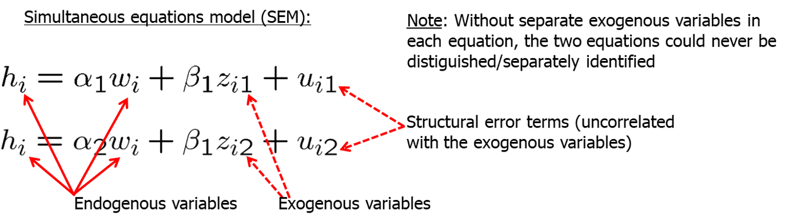
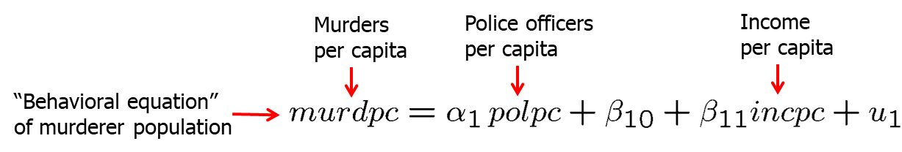
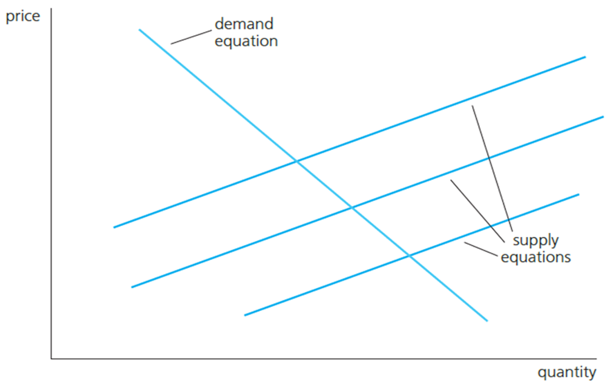

```{r setup, include=FALSE}
options(htmltools.dir.version = FALSE) 
knitr::opts_chunk$set(echo = FALSE, warning = FALSE, message = FALSE, fig.width = 8, fig.height = 6)
library(tidyverse)
library(gghighlight)
library(jtools)
library (wooldridge) # need to load the package before using it
library(fixest) # needed to run the regression feols
library(modelsummary)
library(magrittr)
library(stargazer)

library(AER)


```


``` {r xaringan-themer, include=FALSE, warning=FALSE}
# install.packages("remotes")
#remotes::install_github('rstudio/chromote')
#remotes::install_github("jhelvy/xaringanBuilder")

library(xaringanBuilder)
library(xaringanthemer)
style_duo_accent(
 # primary_color = "#1381B0",
  primary_color = "#006600", # color first slide and titles
  secondary_color = "#FF961C",
  inverse_header_color = "#FFFFFF"  #white
)

#this to build PDF :)
#build_pdf('https://github.com/andrahiriscau/Econometrics_Slides/blob/main/Lecture_1/Econometrics.html')
#build_pdf('https://andrahiriscau.github.io/Econometrics_Slides/Chapter_2/Chapter_2.html')


```

### Outline


---

## Introduction

An  important form of endogeneity of explanatory variables is **simultaneity**. 

  - This arises when one or more of the explanatory variables is **jointly determined** with the dependent variable


Solution: instrumental variable


---

## 16.1 The Nature of Simultaneous Equations Models

Example: Labor demand and supply in agriculture


```{r, out.width="500px", fig.align = 'center'}
knitr::include_graphics("161.png")
```

```{r, out.width="500px", fig.align = 'center'}

```


---

Competition on the labor market in each county $i$ will lead to a county wage $w_i$ so that the total number of hours his supplied by workers in this county equals the total number of hours $h_id$ demanded by agricultural employers in this county:


$h_{i s}=h_{i d} \Rightarrow\left(h_{i}, w_{i}\right) \quad(=$ observed equilibrium outcomes in each county)

```{r, out.width="500px", fig.align = 'center'}

```


---

### Example: Murder rates and the size of the police force

```{r, out.width="500px", fig.align = 'center'}

```

```{r, out.width="500px", fig.align = 'center'}

```


 - `polpc` will not be exogenous because the number of police officers will dependent on how high the murder rate is **(“reverse causation”)**.

 - The interesting equation for policy purposes is the first one. City governments will want to know by how much the murder rate decreases if the number of police officers is exogenously increased.
 
 - This will be hard to measure because the number of police officers is not exogenously chosen (it depends on how much crime there is in the city, see second equation).


---

### Going Further 16.1

A standard model of advertising for monopolistic firms has firms choosing profit maximizing levels of price and advertising expenditures. Does this mean we should use an SEM to model these variables at the firm level?

 - Probably not. It is because firms choose price and advertising expenditures jointly that we are not interested in the experiment where, say, advertising changes exogenously and we want to know the effect on price. Instead, we would model price and advertising each as a function of demand and cost variables. This is what falls out of the economic theory.


---

## 16.2 Simultaneity Bias in OLS 
Variable $y_{2}$ is correlated with the error $u_{1}$ because $u_{1}$ is indirectly a part of $y_{2}$. OLS applied to this equation will be therefore be inconsistent.

$$y_{1}=\alpha_{1} y_{2}+\beta_{1} z_{1}+u_{1}$$
$$ y_{2}=\alpha_{2} y_{1}+\beta_{2} z_{2}+u_{2}$$
Insert the first equation into the second

$$y_{2}=\left[\frac{\alpha_{2} \beta_{1}}{1-\alpha_{2} \alpha_{1}}\right] z_{1}+\left[\frac{\beta_{2}}{1-\alpha_{2} \alpha_{1}}\right] z_{2}+\left[\frac{\alpha_{2} u_{1}+u_{2}}{1-\alpha_{2} \alpha_{1}}\right]$$

Renaming the coefficients, the reduced form equation for $y_2$

$$y_{2}=\pi_{21} z_{1}+\pi_{22} z_{2}+v_{2}$$

The structural equation will produce biased and inconsistent estimators, but the reduced form
equation will produce unbiased and consistent estimators because $z_1$ and $z_2$ are not correlated with
the new error term.


---
### 2SLS estimation of simultaneous equations

Structural equations
$y_{1}=\beta_{0}+\beta_{1} y_{2}+\beta_{2} z_{1}+u_{1}$
$y_{2}=\alpha_{0}+\alpha_{1} y_{1}+\alpha_{2} z_{2}+u_{2}$


  - $z_{2}$ is a good instrument for $y_{2}$ because $z_{2}$ is not in the $y_{1}$ equation and $z_{2}$ is related to $y_{2}$.

  - $z_{1}$ is a good instrument for $y_{1}$ because $z_{1}$ is not in the $y_{2}$ equation and $z_{1}$ is related to $y_{1}$.

2SLS, first stage: reduced form, regress endogenous variables on all exogenous variables and getpredicted values

First stage for eq 1: endogenous variable $y_{2}$ on instrument $z_{2}$ and other exogenous variable $z_{1}$
$$\hat{y}_{2}=\hat{\delta}_{0}+\hat{\delta}_{1} z_{1}+\hat{\delta}_{2} z_{2} $$
First stage for eq 2: endogenous variable $y_{1}$ on instrument $z_{1}$ and other exogenous variable $z_{2}$
$$\hat{y}_{1}=\hat{\gamma}_{0}+\hat{\gamma}_{1} z_{1}+\hat{\gamma}_{2} z_{2}$$

2SLS, second stage: estimate the equations by replacing the predicted values from first stage for the endogenous variables

$$y_{1}=\beta_{0}+\beta_{1} \hat{y}_{2}+\beta_{2} z_{1}+u_{1}$$

$$y_{2}=\alpha_{0}+\alpha_{1} \hat{y}_{1}+\alpha_{2} z_{2}+u_{2}$$


---
## Identifying and Estimating a Structural Equation

OLS is biased and inconsistent when applied to a structural equation in a simultaneous equations system


The mechanics of 2SLS are similar to those in Chapter 15. The difference is that, because we specify a structural equation for each endogenous variable, we can immediately see whether sufficient IVs are available to estimate either equation. 


---
### a) Identification in a Two-Equation System
Example: Supply and demand system


supply of milk $\longrightarrow q=\alpha_{1} p+\beta_{1} z_{1}+u_{1}$

  - where $z_{1}$ is the price of cattle feed


Demand for milk $\longrightarrow q=\alpha_{2} p+u_{2}$


Which of the two equations is identified?

 

---

Supply $q=\alpha_{1} p+\beta_{1} z_{1}+u_{1}$

Demand: $q=\alpha_{2} p+u_{2}$

```{r, out.width="500px", fig.align = 'center'}

```


Which of the two equations is identified?

  - The supply function cannot be consistently estimated because one of the regressors is endogenous and we do not have an instrument.
  - The demand function can be consistently estimated because we can take z1 as an instrument for the endogenous price variable.


???
We have an observed variable z1 that shifts the supply equation while not affecting the demand equation.
In this way the demand equation can be traced out.

---
### Example 16.3 Labor Supply for Married, Working Women

Labor supply and demand for working women.
  - where `kidslt6` is number of kids under 6 years old, and `nwifeinc` is non-wife income

Labor supply of married, working women (hours worked):
 $$hours=\beta_{0}+\beta_{1} lwage +\beta_{2}educ +\beta_{3} age +\beta_{4} kidslt 6+\beta_{5} nwifeinc +u_{1}$$

Labor demand for married, working women (wages offered):


$$lwage=\alpha_{0}+\alpha_{1} hours +\alpha_{2} educ +\alpha_{3} exper +\alpha_{4} exper{ }^{2}+u_{2}$$

`Age`, `number of young children`, and `non-wife income` is a determinant of the supply of labor but not the demand for labor (wages paid) and can be an instrument for `lwage`. Also, experience is a determinat of `lwage` but not how many hours women work and can be used as an instrument for `hours`

???
hours and wages are endogeneous (market equilibrium)

---

Structural equations

hours $=\beta_{0}+\beta_{1}$ lwage $+\beta_{2}$ educ $+\beta_{3}$ age $+\beta_{4}$ kidslt $6+\beta_{5}$ nwifeinc $+u_{1}$

lwage $=\alpha_{0}+\alpha_{1}$ hours $+\alpha_{2}$ educ $+\alpha_{3}$ exper $+\alpha_{4}$ exper ${ }^{2}+u_{2}$


`exper` and $exper^2$ are instruments for `lwage` (`exper` and $exper^2$ are not in the `hours` equation, and `exper` and $exper^2$ are related to `lwage`)

same for `age`, `kidslt6`, and `nwifeinc` being good instruments for `hours`


2SLS, first stage: reduced form, regress endogenous variables on all exogenous variables and get predicted values


First stage for eq 1: endogenous variable `lwage` on instruments `exper` and $exper^2$ and exogenous variables

$$lwage =\delta_{0}+\delta_{1} exper +\delta_{2} exper ^{2}+\delta_{3} educ +\delta_{4} age +\delta_{5} kidslt 6+\delta_{6} nwifeinc +e_{1}$$
2SLS, second stage: estimate the equations by using the predicted values from first stage for endogenous variables


$$hours =\beta_{0}+\beta_{1}\widehat{lwage}+\beta_{2} educ +\beta_{3} age +\beta_{4} kidslt6+\beta_{5} nwifeinc +u_{1}$$
$$lwage =\alpha_{0}+\alpha_{1}\widehat{hours}+\alpha_{2} educ +\alpha_{3} exper +\alpha_{4} exper{ }^{2}+u_{2}$$


---

```{r,echo=FALSE,eval=FALSE}
data(mroz, package = "wooldridge")
mroz %<>% filter(inlf == 1) # keep only working women
# Regression for hours using OLS estimation
model1 <- feols(hours ~ lwage + educ + age + kidslt6 + nwifeinc, data=mroz, se = 'hetero')

# Regression for hours using 2SLS estimation
model2 <-feols(hours ~ educ + age + kidslt6 + nwifeinc | lwage ~ exper+exper^2 , data = mroz) # lwage is instrumented by variables from the other equation
msummary(list(model1,model2), stars = TRUE, gof_omit = 'AIC|BIC|Lik|F|R2')
```
---

In the OLS model, the effect of wage on hours worked is not significant.

In the 2SLS, there is a significant effect of wage on hours worked. 

The coefficient on `lwage` in the hours equation is 1,640. 

  - *For each 1% increase in wages, hours worked increase by 16.40 hours.*

The magnitude and significance of the coefficients change using OLS vs 2SLS.

The coefficients on the instruments `exper`, and `expersq` are individually significant.

An F-test shows that these coefficients are jointly significant.


---

```{r,echo=FALSE,eval=FALSE}
data(mroz, package = "wooldridge")
# Regression for lwage using OLS estimation
model3 <- feols(lwage ~ hours + educ + exper + expersq, data=mroz)
# Regression for hours using 2SLS estimation
# hours is instrumented by variables from the other equation
model4 <-feols(lwage ~ educ +exper + expersq | hours ~ age+ kidslt6 + nwifeinc , data = mroz, se = 'hetero')
msummary(list(model3,model4), stars = TRUE, gof_omit = 'AIC|BIC|Lik|F|R2')

```

---

In the OLS model, the effect of hours on wage is not significant.

In the 2SLS, effect of hours on wage is also not significant.

The OLS results are very similar to the 2SLS results for this equation.

Two of the three coefficients on the instruments `age`, `kidslt6`, and `nwifeinc` are individually significant. 

An F-test shows that these coefficients are jointly significant.


---

### Order and rank conditions for identification


The **order condition* states that an equation is identified if at least one of the exogenous variables is excluded from this equation.

The **rank condition** states that an equation is identified if and only if the other equation includes at least one exogenous variable that is excluded from this equation.


$$y_{1}=\beta_{0}+\beta_{1} y_{2}+\beta_{2} z_{1}+u_{1}$$
$$y_{2}=\alpha_{0}+\alpha_{1} y_{1}+\alpha_{2} z_{2}+u_{2}$$


For the equation for $y_{1}$ to be identified, $z_{2}$ need to be excluded from this equation and included in the other equation of $y_{2}$.

These are the properties for $z_{2}$ to serve as an instrument for $y_{2}$ (excluded from the equation for $y_{1}$ and included in the equation for $\left.y_{2}\right)$.


---

### Testing for the rank condition

The rank condition states that the exogenous variables that are excluded from the equation are included in the other equation. 
This can be tested using the reduced form equation.

For the equation for $y_{1}$ to be identified $y_{1}=\beta_{0}+\beta_{1} y_{2}+\beta_{2} z_{1}+u_{1}$, there needs to be at least one good instrument $z_{2}$ for $y_{2}$.


Estimate the reduced form equation: $y_{2}=\delta_{0}+\delta_{1} z_{1}+\delta_{2} z_{2}+e_{1}$, and test whether the coefficient on the instrument variable $z_{2}$ is significant.


$\mathrm{H}_{0}: \delta_{2}=0$ (equation for $y_{1}$ is not identified)
$\mathrm{H}_{0}: \delta_{2} \neq 0$ (equation for $y_{1}$ is identified)


---
### Testing for the rank condition

Testing for the rank condition: for the equation for `hours` to be identified, there needs to be at least one exogenous variable that is excluded from the equation for `hours` and included in the equation for `lwage`

Estimate the reduced form equation for `lwage`:

lwage $=\delta_{0}+\delta_{1}$ exper $+\delta_{2}$ exper ${ }^{2}+\delta_{3}$ educ $+\delta_{4}$ age $+\delta_{5}$ kidslt $6+\delta_{6}$ nwifeinc $+e_{1}$

  - `exper` and `expersq` are the instruments for `lwage`.

Test if coefficients $\delta_{1}$ and $\delta_{2}$ on exper and exper ${ }^{2}$ are jointly significantly different from zero.

$\mathrm{H}_{0}: \delta_{1}=0$ and $\delta_{2}=0$ (equation for hours is not identified)
$\mathrm{H}_{0}: \delta_{1} \neq 0$ or $\delta_{2} \neq 0$ (equation for hours is identified)


F-statistic $=9.33$ and $p$-value $=0.0001$. The coefficients are jointly significant.

Rank condition is satisfied and the equation for hours is identified.


---
### Testing for the rank condition

Testing for rank condition: for the equation for `lwage` to be identified, there needs to be at least one exogenous variable that is excluded from the equation for `lwage` and included in the equation for `hours`.

Estimate the reduced form equation for `hours`:

hours $=\gamma_{0}+\gamma_{1}$ age $+\gamma_{2}$ kidslt $6+\gamma_{3}$ nwifeinc $+\gamma_{4}$ educ $+\gamma_{5}$ exper $+\gamma_{6}$ exper ${ }^{2}+e_{2}$

  - `age`, `kidslt6`, and `nwifeinc` are the instruments for `hours`.

Test if coefficients $\gamma_{1}$ and $\gamma_{2}$ and $\gamma_{3}$ on `age`, `kidslt6`, and `nwifeinc` are jointly significantly different from zero.

$\mathrm{H}_{0}: \gamma_{1}=0$ and $\gamma_{2}=0$ and $\gamma_{3}=0$ (equation for `lwage` is not identified)
$\mathrm{H}_{0}: \gamma_{1} \neq 0$ or $\gamma_{2} \neq 0$ or $\gamma_{3} \neq 0$ (equation for `lwage` is identified)

F-statistic $=4.46$ and $p$-value $=0.0043$. The coefficients are jointly significant.

Rank condition is satisfied and the equation for lwage is identified.


---

### Review questions?

- What causes the endogeneity bias in simultaneous equations?
- Describe the 2SLS procedure for simultaneous equations.
- Describe the rank condition and testing for the rank condition.


