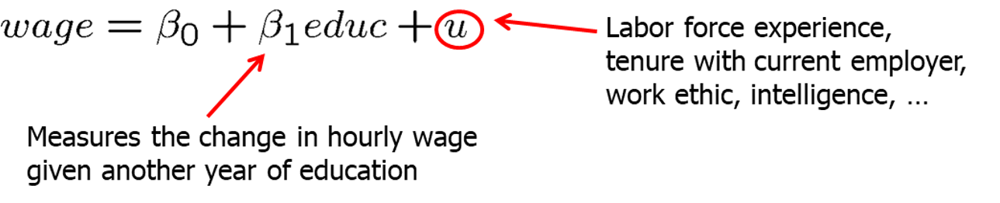

```{r setup, include=FALSE}
options(htmltools.dir.version = FALSE) 
knitr::opts_chunk$set(echo = FALSE, warning = FALSE, message = FALSE, fig.width = 8, fig.height = 6)
library(tidyverse)
library(gghighlight)
library(jtools)

```


``` {r xaringan-themer, include=FALSE, warning=FALSE}
# install.packages("remotes")
#remotes::install_github('rstudio/chromote')
#remotes::install_github("jhelvy/xaringanBuilder")
library (wooldridge) # need to load the package before using it
library(fixest) # needed to run the regression feols
library(modelsummary)
library(xaringanBuilder)
library(xaringanthemer)
style_duo_accent(
 # primary_color = "#1381B0",
  primary_color = "#006600", # color first slide and titles
  secondary_color = "#FF961C",
  inverse_header_color = "#FFFFFF"  #white
)

#this to build PDF :)
#build_pdf('https://github.com/andrahiriscau/Econometrics_Slides/blob/main/Lecture_1/Econometrics.html')
#build_pdf('https://andrahiriscau.github.io/Econometrics_Slides/Chapter_2/Chapter_2.html')

```


---
## 2.1 Definition of the Simple Regression Model

“Explains variable $y$ in terms of variable $x$”


```{r, out.width="400px"}
knitr::include_graphics("21.png")
```

---
### The Simple Regression Model

 

By how much does the dependent variable change if the independent variable is increased by one unit?

--

$$\frac{\Delta y}{\Delta x}=\beta_{1} \quad$$

--

Interpretation only correct if all other  things remain equal when the independent variable is increased by one unit.

 $$\quad \frac{\Delta u}{\Delta x}=0$$

???
add notes
---
### The Simple Regression Model
  - Example: Soybean yield and fertilizer

```{r, out.width = "600px"}


```

--

  - Example: A simple wage equation 

```{r, out.width = "600px"}


```

--

Does $\beta_{1}$ measure a CAUSAL effect of $x$ on $y$?

--

  - It depends on the relationship with $x$ and $u$ 


---
### The Simple Regression Model

**Assumption 1: $E(u)=0$** 

As long as $\beta_{0}$ is included in the regression, nothing is lost assuming that the average value of  $u$ in the population is zero. Why?

--

 - When is there a causal interpretation?
 
--

**Assumption 2:  $E(u|x)=E(u)$**
 
   - The independent variable does not contain information about the mean of the unobserved factors 
   - Average values of the unobservables is the same across all values of $x$, and that the common average is equal to the average of $u$ over the entire population
 
???
prepare the derivation for including/ not including the intercept

---
### The Simple Regression Model

  - Assumption 1: $E(u)=0$ 
  
  - Assumption 2:  $E(u|x)=E(u)$

Combining the assumption 1 and 2:

--  
  
**Zero Conditional Mean Assumption:** $E(u|x)=0$

If zero conditional mean assumption holds, then we have a causal interpretation of our coefficient.

Example:

$$wage=\beta_{0}+\beta_{1} educ+u$$
--

Does $\widehat{\beta_{1}}$ have a causal interpretation (e.g. does education causes higher wages)? Why or why not? 

--

e.g. Intelligence is part of the error term $u$

--

The conditional mean independence assumption is unlikely to hold because individuals with more education will also be more intelligent on average.


---
### Population regression function (PFR)

- The zero conditional mean independence assumption $E(u|x)=0$ implies that:

$$\begin{aligned}
E(y \mid x) &=E\left(\beta_{0}+\beta_{1} x+u \mid x\right) \\
&=\beta_{0}+\beta_{1} x+E(u \mid x) \\
&=\beta_{0}+\beta_{1} x
\end{aligned}$$

- It means that the average value of the dependent variable can be expressed as a linear function of the explanatory variable. This is the *unknown* population function.

--

- $E(y \mid x)$ tells us how the average value if $y$ changes with $x$; it does not say that $y$ equals $\beta_{0}+\beta_{1} x$ for all units in the population
 
--

  - Example $E(colGPA|hsGPA)=1.5+ 0.5hsGPA$

--

- Note: One unit increase in $x$ changes the *expected values* of  $y$ by the amount of $\beta_{1}$

???
check notes here for example

---
### Population regression function (PFR)

```{r, out.width="700px",fig.align = 'center'}
knitr::include_graphics("25.png")

```

---
### Causation VS Correlation

What is correlation?

- Correlation is a statistical measure that expresses the extent to which two variables are linearly related (meaning they change together at a constant rate).
- [Spurious correlations LINK](https://www.tylervigen.com/spurious-correlations) 

--

Correlation **DOES NOT IMPLY** causation !!!

- [Ceteris Paribus VIDEO](https://mru.org/courses/mastering-econometrics/ceteris-paribus)

--

-  **The required assumption to establish causality is the zero conditional mean independence $E(u|x)=0$**


---

## 2.2 Deriving the Ordinary Least Square (OLS) Estimates

- In order to estimate the regression model one needs data

- A random sample of $n$ observations

```{r, out.width="700px"}
knitr::include_graphics("26.png")

```

---
### Deriving the Ordinary Least Square (OLS) Estimates

The Ordinary Least Squares method estimates the intercept and slope of a line that “best fits” the observed data by minimizing the sum of the squared distances between the points and the line.

```{r, out.width="700px"}
knitr::include_graphics("27.png")

```


[**Guess the regression line- SIMULATION**](https://professoramanda.github.io/econsimulations/)

---
### Deriving the Ordinary Least Square (OLS) Estimates (Math)

Let's derive OLS estimates mathematically.

- Define regression **residuals**:

$$\widehat{u}_{i}=y_{i}-\widehat{y}_{i}=y_{i}-\widehat{\beta}_{0}-\widehat{\beta}_{1} x_{i}$$

- Minimize the sum of the squared regression residuals 

$$\min \sum_{i=1}^{n} \widehat{u}_{i}^{2} \rightarrow \widehat{\beta}_{0}, \widehat{\beta}_{1}$$

- OLS estimators

$$\widehat{\beta}_{1}=\frac{\sum_{i=1}^{n}\left(x_{i}-\bar{x}\right)\left(y_{i}-\bar{y}\right)}{\sum_{i=1}^{n}\left(x_{i}-\bar{x}\right)^{2}}$$


$$\quad \widehat{\beta}_{0}=\bar{y}-\widehat{\beta}_{1} \bar{x}$$


---
### Deriving the Ordinary Least Square (OLS) Estimates in R

[Install *wooldridge* package to have access to the data sets-link](https://github.com/JustinMShea/wooldridge)

[Introductory Econometrics Examples-link](https://justinmshea.github.io/wooldridge/articles/Introductory-Econometrics-Examples.html)

Example 2.4 Wage and Education
```{r, echo=TRUE,eval=FALSE}
#install.packages("wooldridge")
library (wooldridge) # need to load the package before using it
library(fixest) # needed to run the regression feols
library(modelsummary)

data ("wage1") # load the data
?wage1 #check out the documentation in the Help panel
# we could use lm package, but feols is useful for future chapters
model<- feols(wage~educ, data=wage1) 
#summary(model)
modelsummary(model)

```
---
Example 2.4 Wage and Education
```{r, echo=FALSE,eval=TRUE}
#install.packages("wooldridge")
library (wooldridge) # need to load the package before using it
library(fixest) # needed to run the regression feols
library(modelsummary)
library(broom)
library(dplyr)
library(knitr)
library(kableExtra)
library(readr)
library(tidyr)
data ("wage1") # load the data
?wage1 #check out the documentation in the Help panel
# we could use lm package, but feols is useful for future chapters
model<-feols(wage~educ, data=wage1)

#summary(model)
modelsummary(model, output = "markdown")
#kableExtra::kable(x = broom::tidy(model), format = "pipe")
#kable(wage1)
```

---
```{r, echo=TRUE}
library(DT)
DT::datatable(head(wage1, 10),
  fillContainer = FALSE, options = list(pageLength = 5))

```

---
## 2.3 Properties of OLS on Any Sample of Data

Fitted (or predicted) values: $\hat{y}_i=\hat{\beta}_0+\hat{\beta}_0x_i$

Residuals: $\hat{u_i}=y_i+\hat{y_i}$

Algebraic properties:

  -  Deviation from the regression (residuals) line sum up to zero 

$$\sum_{i=1}^{n} \widehat{u}_{i}=0$$ 

  -  Covariance between residuals and independent variables is zero 
  
$$\quad \sum_{i=1}^{n} x_{i} \widehat{u}_{i}=0$$

   -  Sample averages of $y$ and $x$ lie on the regression line
    
$$\quad \bar{y}=\widehat{\beta}_{0}+\widehat{\beta}_{1} \bar{x}$$

---
### CEO data

This table presents the predicted values and residuals for 15 CEOs

  - What is the predicted salary for the $12^{th}$ CEO?
  - Is it higher or lower than their actual salary?
  
  - What is the predicted salary for the $5^{th}$ CEO?
  - Is it higher or lower than their actual salary?
  

---
### Goodness of fit

How well does an independent variable explain the dependent variable?

Total sum of squares (SST)- represents the total variation in the dependent variable

$$S S T \equiv \sum_{i=1}^{n}\left(y_{i}-\bar{y}\right)^{2}$$

Explained sum of squares (SSE)- represents variation explained by regression

$$S S E \equiv\sum_{i=1}^{n}\left(\hat{y}_{i}-\bar{y}\right)^{2}$$
Residual sum of squares (SSR)- represents variation **NOT** explained by regression

$$\quad S S R \equiv \sum_{i=1}^{n} \hat{u}_{i}{ }^{2}$$


---
### Goodness of fit

Decomposition of total variation:

Total variation= Explained part + Unexplained part

$$SST= SSE + SSR$$

Goodness-of-fit measure (R-squared)

  - R-squared measure the fraction of the total variation that is explained by the regression


$$R^{2} \equiv \frac{S S E}{S S T}=1-\frac{S S R}{S S T}$$


---
### Goodness-of-fit measure (R-squared)

```{r}
data ("ceosal1") # load the data
data ("vote1") # load the data


models <- list(
  "salary_hat"  = salary_hat<-feols(salary~roe, data=ceosal1),
  "vote_hat" = vote_hat<-feols(voteA~shareA, data=vote1))


modelsummary(models)
```

How do we interpret $R^2$?

???
The regression explains only 1.3% of the total variation in salaries

The regression explains 85.6% of the total variation in election outcomes


---
## 2.4 Units of measurement and functional form

  - **Level- level regression:**
$y=\beta_{0}+\beta_{1} x+\epsilon$

*Interpretation: the coefficient $\beta_{1}$ gives us directly the change in $Y$ for a one-unit change in $X$*

  - **Log- level regression:**  
  
$$\ln (y)=\beta_{0}+\beta_{1} x+\epsilon$$

$$\ln (wage)=\beta_{0}+\beta_{1}educ+\epsilon$$


$$\beta_{1}=\frac{\Delta \log (\text { wage })}{\Delta e d u c}=\frac{1}{w a g e} \cdot \frac{\Delta \text { wage }}{\Delta e d u c}=\frac{\frac{\Delta w a g e}{\text { wage }}}{\Delta e d u c}$$

 $$\widehat{\ln (wage)}=0,584+0.083~educ+\epsilon$$
 
 *Interpretation: The wage increases by 8.3% for every additional year of education.*
???
Because the percentage change in wage is the same for each add. year of educ, the change in wage for an extra year of educ increases as education increases.

---
### Incorporating nonlinearities

  - **Level- log regression:**
  
$y=\beta_{0}+\beta_{1}ln(x)+\epsilon$

*Interpretation: The $\frac{\widehat{\beta_{1}}}{100}$ can be interpreted as the expected increase in $Y$ from a 1% increase in $X$* 

  - **Log- log regression:**
  
$\ln (y)=\beta_{0}+\beta_{1} ln(x)+\epsilon$

*Interpretation: The $\widehat{\beta_{1}}$  is the expected percentage change in $Y$ when $X$ increases by some percentage (elasticity)*

Note: All these models are called linear regression models, even if we allow for nonlinear relationship between $x$ and $y$

???
use wage and ceo data to estimate and interpret coeff

---
### Incorporating nonlinearities (summary)


```{r}
knitr::include_graphics("2a.png",dpi = "100px")

```


---
## 2.5 Expected values and variances of the OLS estimators

Population model: $y=\beta_{0}+\beta_{1} x+\epsilon$

- $\widehat{\beta_{0}},\widehat{\beta_{1}}$ are the estimators for the parameters $\beta_{0},\beta_{1}$

- $\widehat{\beta_{0}},\widehat{\beta_{1}}$ are random variables with sampling distributions

[Sample Distribution of OLS Estimators- Simulations](https://professoramanda.github.io/econsimulations/)

--
Question: On average, will the $\widehat{\beta_{1}}$ be equal to the true parameter $\beta_{1}$ if  we repeatedly sample? How large will their variability be in repeated samples

---
### Expected values and variances of the OLS estimators

 The estimated regression coefficients are random variables because they are calculated from a random sample:
$$\widehat{\beta}_{1}=\frac{\sum_{i=1}^{n}\left(x_{i}-\bar{x}\right)\left(y_{i}-\bar{y}\right)}{\sum_{i=1}^{n}\left(x_{i}-\bar{x}\right)^{2}}, \quad \widehat{\beta}_{0}=\bar{y}-\widehat{\beta}_{1} \bar{x}$$

Data is random and depends on particular sample that has been drawn.

--

 The question is what the estimators will estimate on average and how large will their variability be in repeated samples
$$E\left(\widehat{\beta}_{0}\right)=?, E\left(\widehat{\beta}_{1}\right)=? \quad\\
\operatorname{Var}\left(\widehat{\beta}_{0}\right)=?, \operatorname{Var}\left(\widehat{\beta}_{1}\right)=?$$


---
### Unbiasedness

$$E(\widehat{\beta_{1}})=\beta_{1}$$ 

--

Unbiasedness means that if we could take as many random samples on $Y$ as we want from the population and compute an estimate each time, the average of the estimates would be equal to $\beta_{1}$

There are several assumptions required for OLS estimates toe be unbiased


??? We will study properties of the distributions of  $\widehat{\beta_{0}},\widehat{\beta_{1}}$ over different random samples from the population


---
### Standard Assumptions for the Linear Regression Model (SLR- Simple Linear Regression)

- Assumption SLR 1: **Linear in parameters**

$y=\beta_{0}+\beta_{1} x+u \longleftarrow \begin{aligned}&\text { In the population, the relationship } \\&\text { between } \mathrm{y} \text { and } \mathrm{x} \text { is linear }\end{aligned}$

- Assumption SLR.2 **Random sampling**

$\left\{\left(x_{i}, y_{i}\right): i=1, \ldots, n\right\} \leftarrow$ The data is a random sample drawn from the population

$y_{i}=\beta_{0}+\beta_{1} x_{i}+u_{i} \longleftarrow$ Each data point therefore follows the population equation

```{r,out.width="500px",fig.align = 'center'}
knitr::include_graphics("2b.png",dpi = "100px")

```

???
The population consists, for example, of all workers of country A
In the population, there is a linear relationship between wages (or log wages) and years of education.
Draw completely randomly a worker from the population
The wage and the years of education of the worker drawn are random because one does not know beforehand which worker is drawn.
Throw that worker back into the population and repeat the random draw n times.
The wages and years of education of the sampled workers are used to estimate the linear relationship between wages and education.


---
### Standard Assumptions for the Linear Regression Model (SLR- Simple Linear Regression)

- Assumption SLR.3 **Sample variation in the explanatory variable**

$\sum_{i=1}^{n}\left(x_{i}-\bar{x}\right)^{2}>0$


--
The values of the explanatory variables are not all  the same (otherwise it would be impossible to study how different values of the explanatory variable aligned lead to different values of the dependent variable)

- Assumption SLR.4 **Zero conditional mean**

 $E\left(u_{i} \mid x_{i}\right)=0$ 

--

The value of the explanatory variable must contain no information about the mean of the unobserved factors

 
---
### Unbiasedness of the OLS estimates

$S L R .1-S L R .4 \Rightarrow E\left(\widehat{\beta}_{0}\right)=\beta_{0}, E\left(\widehat{\beta}_{1}\right)=\beta_{1}$

Interpretation of unbiasedness:

- The estimated coefficients may be smaller or larger, depending on the sample that is the result of a random draw.

--

- However, on average, they will be equal to the values that characterize the true relationship between $y$ and $x$ in the population.
--

- "On average" means if sampling was repeated, i.e. if drawing the random sample and doing the estimation was repeated many times.

--

- In a given sample, estimates may differ considerably from true values.


---
### Variances of the OLS estimators

Depending on the sample, the estimates will be nearer or farther away from the true population values.

How far can we expect our estimates to be away from the true population values on average (= sampling variability)?

Sampling variability is measured by the estimator‘s variances


- Assumption SLR5: **Homoskedasticity**

$\operatorname{Var}\left(u_{i} \mid x_{i}\right)=\sigma^{2}$ 

The value of the explanatory variable must contain no information about the variability of the unobserved factors

---
### Homoskedasticity VS Heteroskedasticity


```{r, out.width="600px",fig.align = 'center'}


```

--

```{r, out.width="600px",fig.align = 'center'}
knitr::include_graphics("2d.png")

```

---
### Variances of the OLS estimators

$$\operatorname{Var}\left(\widehat{\beta}_{1}\right)=\frac{\sigma^{2}}{\sum_{i=1}^{n}\left(x_{i}-\bar{x}\right)^{2}}=\frac{\sigma^{2}}{S S T_{x}}$$


$$\operatorname{Var}\left(\widehat{\beta}_{0}\right)=\frac{\sigma^{2} n^{-1} \sum_{i=1}^{n} x_{i}^{2}}{\sum_{i=1}^{n}\left(x_{i}-\bar{x}\right)^{2}}=\frac{\sigma^{2} n^{-1} \sum_{i=1}^{n} x_{i}^{2}}{S S T_{x}}$$

---
### Estimating the error variance

 The variance of u does not depend on $x$ i.e. equal to the unconditional variance
 
$$\operatorname{Var}\left(u_{i} \mid x_{i}\right)=\sigma^{2}=\operatorname{Var}\left(u_{i}\right)$$
--

 One could estimate the variance of the errors by calculating the variance of the residuals in the sample; unfortunately this estimate would be biased 
 
$$\hat{\sigma}^{2}=\frac{1}{n} \sum_{i=1}^{n}\left(\hat{u}_{i}-\overline{\hat{u}}_{i}\right)^{2}=\frac{1}{n} \sum_{i=1}^{n} \hat{u}_{i}^{2}$$

--

An unbiased estimate of the error variance can be obtained by substracting the number of estimated regression coefficients from the number of observations:

$$\widehat{\sigma}^{2}=\frac{1}{n-2} \sum_{i=1}^{n} \widehat{u}_{i}^{2}$$

---
### Unbiasedness of the error variance

$$S L R .1-S L R .5 \quad \Rightarrow \quad E\left(\widehat{\sigma}^{2}\right)=\sigma^{2}$$

- Calculation of standard errors for regression coefficients

$$\begin{aligned}
&\operatorname{se}\left(\widehat{\beta}_{1}\right)=\sqrt{\widehat{\operatorname{Var}}\left(\widehat{\beta}_{1}\right)}=\sqrt{\hat{\sigma}^{2} / S S T_{x}} \\
&\operatorname{se}\left(\hat{\beta}_{0}\right)=\sqrt{\widehat{\operatorname{Var}\left(\hat{\beta}_{0}\right)}}=\sqrt{\hat{\sigma}^{2} n^{-1} \sum_{i=1}^{n} x_{i}^{2} / S S T_{x}}
\end{aligned}$$

The estimated **standard deviations** of the regression coefficients are called **"standard errors."** They measure how precisely the regression coefficients are estimated.
