```{r setup, include=FALSE}
options(htmltools.dir.version = FALSE) 
knitr::opts_chunk$set(echo = FALSE, warning = FALSE, message = FALSE, fig.width = 8, fig.height = 6)
library(tidyverse)
library(gghighlight)
library(jtools)
library (wooldridge) # need to load the package before using it
library(fixest) # needed to run the regression feols
library(modelsummary)

```


``` {r xaringan-themer, include=FALSE, warning=FALSE}
# install.packages("remotes")
#remotes::install_github('rstudio/chromote')
#remotes::install_github("jhelvy/xaringanBuilder")

library(xaringanBuilder)
library(xaringanthemer)
style_duo_accent(
 # primary_color = "#1381B0",
  primary_color = "#006600", # color first slide and titles
  secondary_color = "#FF961C",
  inverse_header_color = "#FFFFFF"  #white
)

#this to build PDF :)
#build_pdf('https://github.com/andrahiriscau/Econometrics_Slides/blob/main/Lecture_1/Econometrics.html')
#build_pdf('https://andrahiriscau.github.io/Econometrics_Slides/Chapter_2/Chapter_2.html')


```


## 3.1 Definition of the multiple linear regression model


"Explains variable $y$ in terms of variables $x_{1}, x_{2}, \ldots, x_{k}$ "

```{r, out.width="600px", fig.align = 'center'}
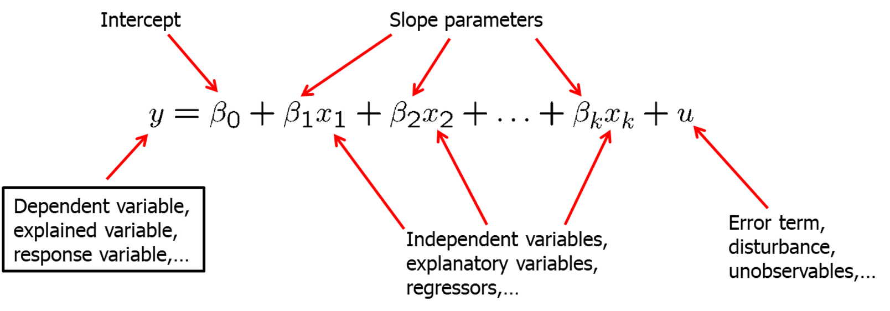
```

--

Why use multiple regression model?

--
<ol>
  <li>  Incorporate more explanatory factors into the model
--
  <li>  Explicitly hold fixed other factors that otherwise would be in the error term
--
  <li> Allow for more flexible functional forms
  </ol>


---

### Examples

 - Wage equation
 
```{r, out.width="500px", fig.align = 'center'}
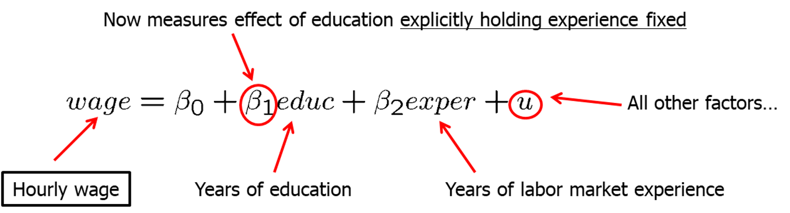
```

--

  - Average test scores and per student spending
  
```{r, out.width="500px", fig.align = 'center'}
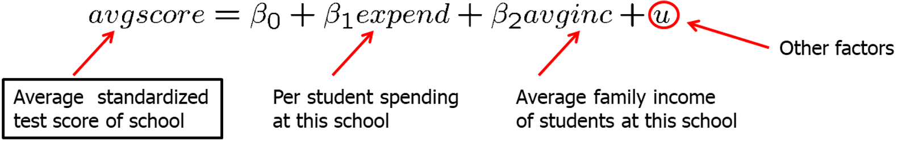
```

   - Per student spending is likely to be correlated with average family income at a given high school because of school financing.
    
   - Omitting average family income in regression would lead to biased estimate of the effect of spending on average test scores.

   - In a simple regression model, effect of per student spending would partly include the effect of family income on test scores.

---

### Examples

  - Family income and family consumption
      - Model has two explanatory variables: income and income squared


```{r, out.width="500px", fig.align = 'center'}
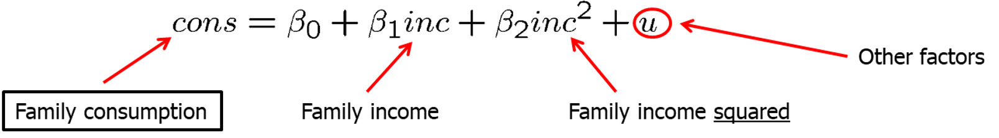
```

By how much does consumption increase if income is increased by one unit?

--

$$\frac{\Delta \operatorname{con} s}{\Delta \operatorname{inc}} \approx \beta_{1}+2 \beta_{2} \operatorname{inc}$$

Depends on how much income is already there

--

   - CEO salary, sales and CEO tenure
   
```{r, out.width="500px", fig.align = 'center'}
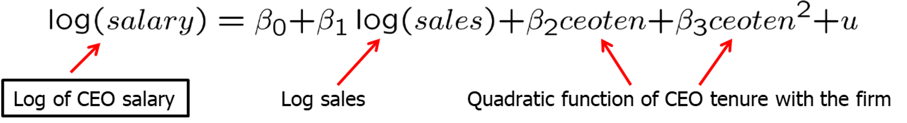
```

--

Note: Meaning of “linear” regression- the model has to be linear in the parameters (not in the variables)

   


???
Consumption is explained as a quadratic function of income

Model assumes a constant elasticity relationship between CEO salary and the sales of his or her firm.
Model assumes a quadratic relationship between CEO salary and his or her tenure with the firm.


---

## 3.2 Mechanics and Interpretation of Ordinary Least Squares

 ### a) Obtaining the OLS estimates
 
 - Random sample
 
$$\left\{\left(x_{i 1}, x_{i 2}, \ldots, x_{i k}, y_{i}\right): i=1, \ldots, n\right\}$$

- Regression residuals
$$\widehat{u}_{i}=y_{i}-\widehat{\beta}_{0}-\widehat{\beta}_{1} x_{i 1}-\widehat{\beta}_{2} x_{i 2}-\ldots-\widehat{\beta}_{k} x_{i k}$$
- Minimize sum of squared residuals
$$\min \sum_{i=1}^{n} \widehat{u}_{i}^{2} \rightarrow \widehat{\beta}_{0}, \widehat{\beta}_{1}, \widehat{\beta}_{2}, \ldots, \widehat{\beta}_{k}$$

???
The method of OLS chooses the estimates to minimize the sum of squared residuals

---

 ### b) Interpreting the OLS Regression Equation
 
$$\widehat{y}=\widehat{\beta_{0}}+\widehat{\beta_{1}} x_{1}+\widehat{\beta_{2}} x_{2}+\ldots+\widehat{\beta_{k}} x_{k}$$

By how much does the dependent variable change if the k-th independent variable is increased by one unit, holding all other independent variables constant?

--

$\beta_{k}=\frac{\Delta y}{\Delta x_{k}}$

  - "Ceterius paribus" holding all other independent variables constant
  
  - The multiple linear regression model manages to hold the values of other explanatory variables fixed even if they are correlated with the explanatory variable under consideration.
  
  - It has still to be assumed that unobserved factors do not change if the explanatory variables are changed.

  
---

Example: 3.1 Determinants of college GPA

```{r,echo=TRUE,eval=TRUE}
data(gpa1, package='wooldridge')

GPAres<-feols(colGPA~ hsGPA+ACT, data = gpa1)
GPAsingle<-feols(colGPA~ hsGPA, data = gpa1)

models <- list(GPAres, GPAsingle)

modelsummary(models,output = "markdown")

```
  ???
  Interpretation example 3.1
  Interpretation
Holding ACT fixed, another point on high school grade point average is associated with another .453 points college grade point average
Or: If we compare two students with the same ACT, but the hsGPA of student A is one point higher, we predict student A to have a colGPA that is .453 higher than that of student B
Holding high school grade point average fixed, another 10 points on ACT are associated with less than one point on college GPA

  
---
  
  Example: 3.2 Hourly wage equation
  
```{r,echo=TRUE,eval=TRUE}
data(wage1, package='wooldridge')

summary(feols(lwage~educ+exper+tenure, data = wage1))
```

???
example 3.2 interpretation


---

### c) The Meaning of "Holding Other Factors Fixed" in Multiple Regression


- In example 3.1, we observed that the coefficient on `ACT` measures the predicted difference in `colGPA`, holding `hsGPA` fixed

--

- It may seem that we sampled people with the same `hsGPA` but different `ACT` scores

--

- **Data is random** , no restrictions were placed on the values of `hsGPA` and `ACT`

--

- If we could collect a sample of individuals with the same HSGPA, then we could preform a simple regression `ColGPA` and `ACT`

--

- Multiple regression allows us to mimic this situation without restricting the values of any independent variables


---


### d) Changing More than One Independent Variable Simultaneously


  $$\widehat{\Delta \log (\text { wage })}=.0041{\Delta exper}+ 0.22{\Delta tenure} $$
  
  What is the effect on `wage` if `exper` and `tenure` both increase by *one year*?
  
--
  
  The total effect  (holding `educ` fixed) is: 
  
  $$\widehat{\Delta \log (\text { wage })}=.0041{\Delta exper}+ 0.22{\Delta tenure}==.0041+.022=.0261$$
    
 Because `exper` and `tenure` each increase by one year, we just add the coefficients on  `exper` and `tenure` and multiply by 100 to tun the effect into percentage (about 2.6 %).
 
 
---

 ### e) OLS Fitted Values and Residuals
 
 
 Fitted Values:
    
$$\widehat{y}_{i}=\widehat{\beta}_{0}+\widehat{\beta}_{1} x_{i 1}+\widehat{\beta}_{2} x_{i 2}+\ldots+\widehat{\beta}_{k} x_{i k}$$
Residuals:

$$\widehat{u}_{i}=y_{i}-\widehat{y}_{i}$$

Algebraic properties of OLS regression:

--

1. Deviations from regression line sum up to zero

  $$\sum_{i=1}^{n} \widehat{u}_{i}=0$$
--

2. Covariance between deviations and regressors are zero
 
  $$\quad \sum_{i=1}^{n} x_{i j} \widehat{u}_{i}=0 \quad$$
--

3. Sample averages of $y$ and of the regressors lie on regression line

  $$\bar{y}=\widehat{\beta}_{0}+\widehat{\beta}_{1} \bar{x}_{1}+\ldots+\widehat{\beta}_{k} \bar{x}_{k}$$
  
  
---
### f) "Partialling Out" Interpretation of Multiple Regression

One can show that the estimated coefficient of an explanatory variable in a multiple regression can be obtained in two steps:

1) Regress the explanatory variable on all other explanatory variables
2) Regress y on the residuals from this regression

Why does this procedure work?
The residuals from the first regression is the part of the explanatory variable that is uncorrelated with the other explanatory variables.
The slope coefficient of the second regression therefore represents the isolated effect of the explanatory variable on the dependent variable.


---
### h) Goodness-of-fit


Decomposition of total variation
$$S S T=S S E+S S R$$
$\mathrm{R}$ squared

$$R^{2} \equiv \frac{S S E}{ S S T}=1-\frac{S S R}{S S T}$$

Alternative expression for $\mathrm{R}$ squared
$$R^{2}=\frac{\left(\sum_{i=1}^{n}\left(y_{i}-\bar{y}\right)\left(\widehat{y}_{i}-\overline{\hat{y}}\right)\right)^{2}}{\left(\sum_{i=1}^{n}\left(y_{i}-\bar{y}\right)^{2}\right)\left(\sum_{i=1}^{n}\left(\widehat{y}_{i}-\overline{\bar{y}}\right)^{2}\right)}$$

---
#### Examples

Explaining arrest records

```{r, out.width="500px", fig.align = 'center'}
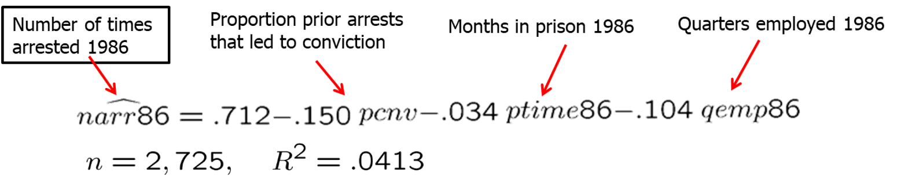
```

Interpretation:

  - If the proportion prior arrests increases by 0.5, the predicted fall in arrests is 7.5 arrests per 100 men.
  - If the months in prison increase from 0 to 12, the predicted fall in arrests is 0.408 arrests for a particular man.
  - If the quarters employed increase by 1, the predicted fall in arrests is  10.4 arrests per 100 men.


--

An additional explanatory variable is added.

```{r, out.width="500px", fig.align = 'center'}
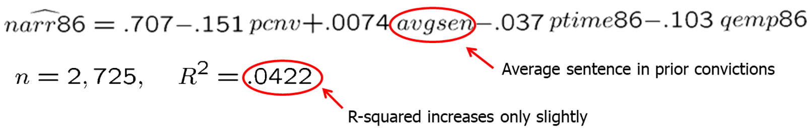
```

Interpretation:
  - Average prior sentence increases number of arrests (?)
  - Limited additional explanatory power as R-squared increases by little
  
General remark on R-squared
  - Even if R-squared is small (as in the given example), regression may still provide good estimates of ceteris paribus effects.


---
### 3.3 The Expected Value of OLS Estimators

Standard assumptions for the multiple regression model

**MLR 1. Linear in parameters**

$$y=\beta_{0}+\beta_{1} x_{1}+\beta_{2} x_{2}+\ldots+\beta_{k} x_{k}+u$$


**MLR 2. Random sampling**

$$\left\{\left(x_{i 1}, x_{i 2}, \ldots, x_{i k}, y_{i}\right): i=1, \ldots, n\right\}$$
$$y_{i}=\beta_{0}+\beta_{1} x_{i 1}+\beta_{2} x_{i 2}+\ldots+\beta_{k} x_{i k}+u_{i}$$
---
**MLR 3. No perfect collinearity**

In the sample (and therefore in the population), none of the independent variables is constant and there are no exact linear relationships among the independent variables.


Remarks:
  - The assumption only rules out perfect collinearity/correlation between explanatory variables; **imperfect correlation** is allowed.
  - If an explanatory variable is a perfect linear combination of other explanatory variables it is superfluous and may be eliminated.
  - Constant variables are also ruled out (collinear with intercept).


---

- Example for perfect collinearity: 
$$small~ sample ~avgscore =\beta_{0}+\beta_{1}expend+\beta_{2}avginc +u$$
In a small sample, `avginc` may accidentally be an exact multiple of expend; it will not be possible to disentangle their separate effects because there is exact covariation
- Example for perfect collinearity: relationships between regressors

$$vote~A=\beta_{0}+\beta_{1}share~A+\beta_{2}share~B+u$$
Either *share A* or *share B* will have to be dropped from the regression because there is an exact linear relationship between them: $share ~A+ share~B=1$


---
**MLR 4. Zero conditional mean**

The value of the explanatory variables must contain no information about the mean of the unobserved factors:

$E\left(u_{i} \mid x_{i 1}, x_{i 2}, \ldots, x_{i k}\right)=0$

In a multiple regression model, the zero conditional mean assumption is much more likely to hold because fewer things end up in the error term

Example: Average test scores

$avgscore=\beta_{0}+\beta_{1}expend +\beta_{2} \operatorname{avgin} c+u$

  - If `avgin` was not included in the regression, it would end up in the error term
  - I would then be harder to defend that `expend` is uncorrelated with the error term

  

**Theorem. Unbiasedness of OLS: Under assumptions MLR.1 and MLR.4 $E(\widehat{\beta_{j}}=\beta_{j})$ for j=0,1, \dots k  for any values of the population parameter $\beta_{j}$. In other words, the OLS estimators are unbiased estimators of the population parameters**  
  
  
  
---
### Including irrelevant variables in the regression model  (overspecifying the model)


$$y_{i}=\beta_{0}+\beta_{1} x_{i 1}+\beta_{2} x_{i 2}+\beta_{3} x_{i 3}+u_{i}$$
No problem because $E(\widehat{\beta_{3}})=\beta_{3}=0$

However, including irrelevant variables may increase sampling variance. Why?

---
### Ommitting relevant variables: the simple case

True model contains $x_{1}$ and $x_{2}$

$$y=\beta_{0}+\beta_{1} x_{1}+\beta_{2} x_{2}+u$$
Estimated model ($x_{2}$ is omitted)

$\tilde{y}=\tilde{\beta}_{0}+\tilde{\beta}_{1} x_{1}+\tilde{u}$


--

Omitted variable bias

If  $x_{1}$ and $x_{2}$ are corrrelated, assume a linear regression relationship between them

$$x_{2}=\delta_{0}+\delta_{1} x_{1}+v$$

$$y=\beta_{0}+\beta_{1} x_{1}+\beta_{2}\left(\delta_{0}+\delta_{1} x_{1}+v\right)+u$$

   
```{r, out.width="500px", fig.align = 'center'}
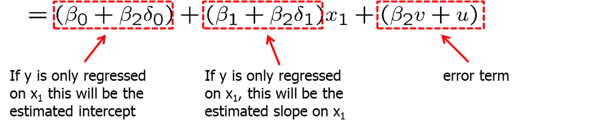
```


Conclusion: All estimated coefficients will be biased


---
### Ommitted variable bias

Example: Omitting ability in a wage equation


   
```{r, out.width="500px", fig.align = 'center'}
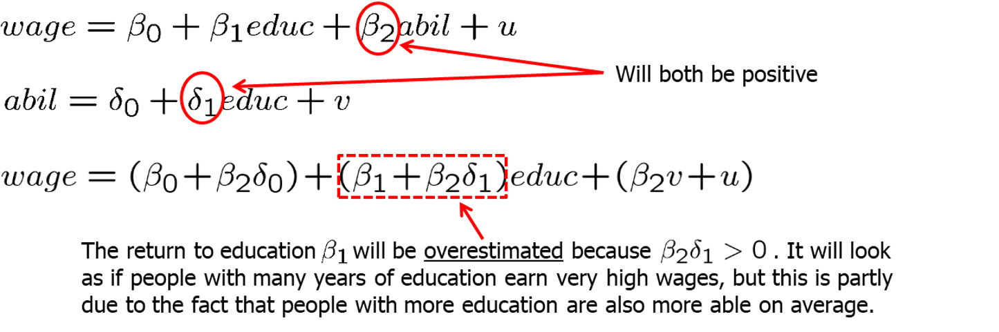
```


When is there no omitted variable bias?
  - If the omitted variable is irrelevant or uncorrelated


[What is omitted variable bias?](https://www.youtube.com/watch?v=b4jhrK03zhs)


---

### Ommitted variable bias

Example: Omitting ability in a wage equation

$$wage=\beta_{0}+\beta_{1} e d u c+\beta_{2} exper +\beta_{3} a b i l+u$$
If `exper` is approximately uncorrelated with `educ` and `abil`, then the direction of the omitted variable bias can be as analyzed in the simple two variable case. 


```{r, out.width="500px", fig.align = 'center'}
knitr::include_graphics("table.png")
```


---

**MLR.5 Homoskedasticity** 

The value of the explanatory variables must contain no information about the variance of the unobserved factors

$\operatorname{Var}\left(u_{i} \mid x_{i 1}, x_{i 2}, \ldots, x_{i k}\right)=\sigma^{2}$

Example: Wage equation
$\operatorname{Var}\left(u_{i} \mid\right.$ educ $_{i}$, exper $_{i}$, tenure $\left._{i}\right)=\sigma^{2}$

This assumption may also be hard to justify in many cases


Short hand notation:

$\operatorname{Var}\left(u_{i} \mid \mathbf{x}_{i}\right)=\sigma^{2} \quad$ with $\quad \mathbf{x}_{i}=\left(x_{i 1}, x_{i 2}, \ldots, x_{i k}\right)$


---
## 3.4 The Variance of the OLS Estimators


**Theorem: Sampling variances of the OLS slope estimators**

**Under assumptions MLR.1 through MLR.5, conditional on the sample values of the independet variables: **

```{r, out.width="500px", fig.align = 'center'}
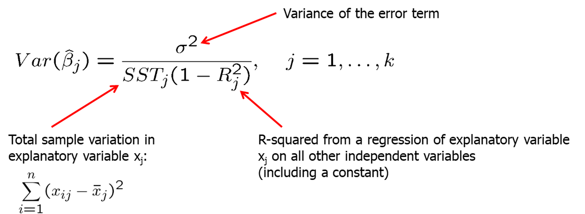
```

for $j=1,2,\ldots k$


Note: $R_{j}^2$ is the R-squared  from regression $x_{j}$ on all other independent variables (and including an intercept)


---
### Components of OLS variances

1. The error variance $(\sigma^2)$

  - A high error variance increases the sampling variance because there is more “noise” in the equation.
  
  - A large error variance does not necessarily make estimates imprecise.
  
  - The error variance does not decrease with sample size.


2. The Total Sample Variation in $x_{j}$

$\operatorname{SST}_{j}=\sum_{i=1}^{n}\left(x_{i j}-\bar{x}_{j}\right)^{2}$

  - More sample variation leads to more precise estimates.
  
  - Total sample variation automatically increases with the sample size.
  
  - Increasing the sample size is thus a way to get more precise estimates.

---
### Components of OLS variances

3. Linear relationships among the independent variables

  - Regress $x_{j}$ on all other independent variables (including  constant)

  - The R-squared of this regression will be the higher when $x_{j}$ can be better explained by the other independent variables.

  - The sampling variance of the slope estimator for $x_{j}$ will be higher when $x_{j}$ can be better explained by the other independent variables.

  - Under perfect multicollinearity, the variance of the slope estimator will approach infinity.


---
### Multicollinearity


```{r, out.width="500px", fig.align = 'center'}
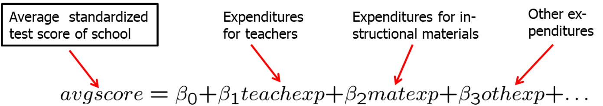
```

  - The different expenditure categories will be strongly correlated because if a school has a lot of resources it will spend a lot on everything. 

  - It will be hard to estimate the differential effects of different expenditure categories because all expenditures are either high or low. For precise estimates of the differential effects, one would need information about situations where expenditure categories change differentially.

  - As a consequence, sampling variance of the estimated effects will be large.

  - In the above example, it would probably be better to lump all expen-diture categories together because effects cannot be disentangled.

  - In other cases, dropping some independent variables may reduce multicollinearity (but this may lead to omitted variable bias).


---
### Multicollinearity

Only the sampling variance of the variables involved in multicollinearity will be inflated; the estimates of other effects may be very precise.

Note that multicollinearity is not a violation of MLR.3 in the strict sense.

Multicollinearity may be detected through “variance inflation factors.”

As an (arbitrary) rule of thumb, the variance inflation factor (VIF) should not be larger than 10.

$$V I F_{j}=\frac{1}{1-R_{j}^{2}}$$

---
### Variances in misspecified models

The choice of whether to include a particular variable in a regression can be made by analyzing the tradeoff between bias and variance.

True population model
$y=\beta_{0}+\beta_{1} x_{1}+\beta_{2} x_{2}+u$

Estimated model 1
$\widehat{y}=\widehat{\beta}_{0}+\widehat{\beta}_{1} x_{1}+\widehat{\beta}_{2} x_{2}$

Estimated model 2
$\tilde{y}=\widetilde{\beta}_{0}+\widetilde{\beta}_{1} x_{1} \longleftarrow$ 


It might be the case that the likely omitted variable bias in the misspecified model 2 is overcompensated by a smaller variance.


---
### Variances in misspecified models

Conditional on $ x_{1}$ and $ x_{2}$, the variance of model 2 is always smaller than that in model 1

$\operatorname{Var}\left(\widehat{\beta}_{1}\right)=\sigma^{2} /\left[S S T_{1}\left(1-R_{1}^{2}\right)\right]$

$\operatorname{Var}\left(\widetilde{\beta}_{1}\right)=\sigma^{2} / S S T_{1}$


 - Case 1
 
$\beta_{2}=0 \Rightarrow E\left(\widehat{\beta}_{1}\right)=\beta_{1}, E\left(\widetilde{\beta}_{1}\right)=\beta_{1}, \operatorname{Var}\left(\widetilde{\beta}_{1}\right)<\operatorname{Var}\left(\widehat{\beta}_{1}\right)$
 
 Conclusion: Do not include irrelevant regressors
 
 - Case 2
 
 $\beta_{2} \neq 0 \Rightarrow E\left(\widehat{\beta}_{1}\right)=\beta_{1}, E\left(\widetilde{\beta}_{1}\right) \neq \beta_{1}, \operatorname{Var}\left(\widetilde{\beta}_{1}\right)<\operatorname{Var}\left(\widehat{\beta}_{1}\right)$
 
 Conclusion: Trade off bias and variance; Caution: bias will not vanish even in large samples
 
  
---
 ### Estimating the error variance
 
 $\hat{\sigma}^{2}=\left(\sum_{i=1}^{n} \widehat{u}_{i}^{2}\right) /[n-k-1]$


An unbiased estimate of the error variance can be obtained by substracting the number of estimated regression coefficients from the number of observations. 
The number of observations minus the number of estimated parameters is also called the degrees of freedom. 
The `n` estimated squared residuals in the sum are not completely independent but related through the `k+1` equations that define the first order conditions of the minimization problem.


???
https://stats.stackexchange.com/questions/201352/why-divide-by-n-2-for-residual-standard-errors

https://www.khanacademy.org/math/ap-statistics/summarizing-quantitative-data-ap/more-standard-deviation/v/review-and-intuition-why-we-divide-by-n-1-for-the-unbiased-sample-variance


---
### Estimation of the sampling variances of the OLS estimators

The true sampling variation of the estimated $\beta_{j}$

$s d\left(\widehat{\beta}_{j}\right)=\sqrt{\operatorname{Var}\left(\widehat{\beta}_{j}\right)}=\sqrt{\sigma^{2} /\left[S S T_{j}\left(1-R_{j}^{2}\right)\right]}$


The estimated sampling variation of the estimated $\beta_{j}$

Plug $\hat{\sigma}^{2}$ for ${\sigma}^{2}$

$\operatorname{se}\left(\widehat{\beta}_{j}\right)=\sqrt{\widehat{\operatorname{Var}}\left(\widehat{\beta}_{j}\right)}=\sqrt{\left.\hat{\sigma}^{2}\right /\left[S S T_{j}\left(1-R_{j}^{2}\right)\right]}$


Note: that these formulas are only valid under assumptions   MLR.1-MLR.5 (in particular, there has to be homoskedasticity)


---
## Efficiency of OLS: The Gauss-Markov Theorem

Under assumptions MLR.1 - MLR.5, OLS is unbiased

However, under these assumptions there may be many other estimators that are unbiased.

Which one is the unbiased estimator with the smallest variance?

In order to answer this question one usually limits oneself to linear estimators, i.e. estimators linear in the dependent variable.


May be an arbitrary function of the sample values of all the explanatory variables; the OLS estimator can be shown to be of this form:

$\tilde{\beta}_{j}=\sum_{i=1}^{n} w_{i j} y_{i}$
 

---
### Efficiency of OLS: The Gauss-Markov Theorem

Under assumptions MLR.1 - MLR.5, the OLS estimators are the best linear unbiased estimators (BLUEs) of the regression coefficients, i.e.


$$\operatorname{Var}\left(\widehat{\beta}_{j}\right) \leq \operatorname{Var}\left(\widetilde{\beta}_{j}\right) \quad j=0,1, \ldots, k$$
for all $\widetilde{\beta}_{j}=\sum_{i=1}^{n} w_{i j} y_{i}$ for which $E\left(\widetilde{\beta}_{j}\right)=\beta_{j}, j=0, \ldots, k$.


OLS is only the best estimator if MLR.1 – MLR.5 hold; if there is heteroskedasticity for example, there are better estimators.
