```{r setup, include=FALSE}
options(htmltools.dir.version = FALSE) 
knitr::opts_chunk$set(echo = FALSE, warning = FALSE, message = FALSE, fig.width = 8, fig.height = 6)
library(tidyverse)
library(gghighlight)
library(jtools)
library (wooldridge) # need to load the package before using it
library(fixest) # needed to run the regression feols
library(modelsummary)

```


``` {r xaringan-themer, include=FALSE, warning=FALSE}
# install.packages("remotes")
#remotes::install_github('rstudio/chromote')
#remotes::install_github("jhelvy/xaringanBuilder")

library(xaringanBuilder)
library(xaringanthemer)
style_duo_accent(
 # primary_color = "#1381B0",
  primary_color = "#006600", # color first slide and titles
  secondary_color = "#FF961C",
  inverse_header_color = "#FFFFFF"  #white
)

#this to build PDF :)
#build_pdf('https://github.com/andrahiriscau/Econometrics_Slides/blob/main/Lecture_1/Econometrics.html')
#build_pdf('https://andrahiriscau.github.io/Econometrics_Slides/Chapter_2/Chapter_2.html')


```

### Objectives

In this chapter, we are testing hypothesis about parameters in the population regression model:

  - find distribution of the OLS estimators
  
  - cover hypothesis testing about individual parameters
  
  - construction of confidence intervals 

  - how to test a single hypothesis involving more than one parameter
  
  - determine whether a group of independent variables can be omitted from a model
  
  
  
---
## 4.1 Sampling Distributions of the OLS Estimators
  
  
  - The OLS estimators are random variables
  - We already know their expected values and their variances
  - However, for hypothesis tests we need to know their distribution
  
  - In order to derive their distribution we need additional assumptions
      - Assumption about distribution of errors: normal distribution

**MLR.6 Normality of error terms**
  
$$u_{i} \sim \operatorname{Normal}\left(0, \sigma^{2}\right) independently ~of~ x_{i 1}, x_{i 2}, \ldots, x_{i k}$$
  
  
  
---
### Normality of error terms

  
```{r, out.width="700px", fig.align = 'center'}
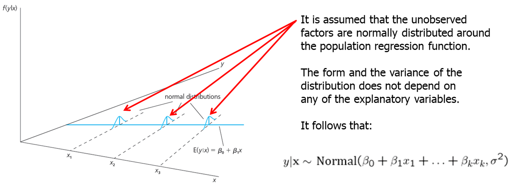
```
  

---
### Discussion of the normality assumption

The error term is the sum of “many” different unobserved factors.
Sums of independent factors are normally distributed.
Problems:
  - How many different factors? Number large enough?
  - Possibly very heterogeneous distributions of individual factors
  - How independent are the different factors?

The normality of the error term is an empirical question.
At least, the error distribution should be “close” to normal.
In many cases, normality is questionable or impossible by definition.


---
### Discussion of the normality assumption

Examples where normality cannot hold:
  - Wages (non-negative; also: minimum wage)
  - Number of arrests (takes on a small number of integer values)
  - Unemployment (indicator variable, takes on only 1 or 0)

In some cases, normality can be achieved through transformations of the dependent variable (e.g. use log(wage) instead of wage).
Under normality, OLS is the best (even nonlinear) unbiased estimator
Important: For the purposes of statistical inference, the assumption of normality can be replaced by a large sample size.

**Law of large numbers**

---
### Terminology

MLR.1- MLR.5 "Gauss- Markov Assumption"

MLR.1- MLR.6 "Classical lineal model (CLM) assumptions"


**Theorem 4.1 (Normal sampling distributions), under MLR.1- MLR.6 assumptions**

The estimators are normally distributed around the true parameters with the variance that was derived earlier

$$\widehat{\beta}_{j} \sim \operatorname{Normal}\left(\beta_{j}, \operatorname{Var}\left(\hat{\beta}_{j}\right)\right)$$

The standardized estimators follow a standard normal distribution

$$\frac{\widehat{\beta}_{j}-\beta_{j}}{s d\left(\widehat{\beta}_{j}\right)} \sim \operatorname{Normal}(0,1)$$

---
## 4.2 Testing hypothesis about a single population parameter


**Theorem 4.2 t distribution for the standardized estimators**

If the standardization is done using the estimated standard deviation (=standard error), the normal distribution is replace by a t-distribution

$$\frac{\widehat{\beta}_{j}-\beta_{j}}{\operatorname{se}\left(\widehat{\beta}_{j}\right)} \sim t_{n-k-1}$$

Note: The t-distribution is close to the standard normal distribution if `n-k-1` is large


---
### Null hypothesis 

The population parameter is equal to zero, i.e. after controlling for the other independent variables, there is no effect of $x_{j}$ on $y$

$$H_{0}: \beta_{j}=0$$
 t-statistic (or t-ratio)

$$t_{\hat{\beta}_{j}} \equiv \frac{\hat{\beta}_{j}}{\operatorname{se}\left(\widehat{\beta}_{j}\right)}$$

 - The t-statistic will be used to test the above null hypothesis. 
 - The farther the estimated coefficient is away from zero, the less likely it is that the null hypothesis holds true. 
 - But what does "far" away from zero mean? standard deviation. 
 - The t-statistic measures how many estimated standard deviations the estimated coefficient is away from zero.


Distribution of the t-statistic if the null hypothesis is true

$$t_{\widehat{\beta}_{j}} \equiv \widehat{\beta}_{j} / \operatorname{se}\left(\widehat{\beta}_{j}\right)=\left(\widehat{\beta}_{j}-\beta_{j}\right) / \operatorname{se}\left(\widehat{\beta}_{j}\right) \sim t_{n-k-1}$$

Goal: Define a rejection rule so that, if it is true, $H_0$ is rejected only with a small probability (= significance level, e.g. 5%)


---
### a) Testing against One- Sided Alternatives

  
```{r, out.width="500px", fig.align = 'center'}
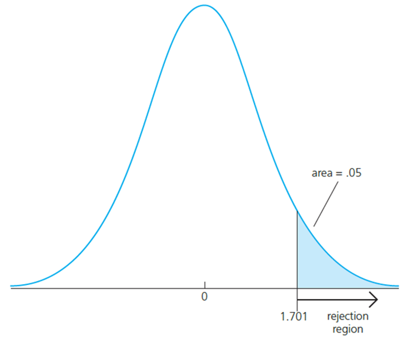
```
  
  - Reject the null hypothesis in favour of the alternative hypothesis if the estimated coefficient is “too large” (i.e. larger than a critical value).

  - Construct the critical value so that, if the null hypothesis is true, it is rejected in, for example, 5% of the cases.

  - In the given example, this is the point of the t-distribution with 28 degrees of freedom that is exceeded in 5% of the cases.

  - Reject if t-statistic is greater than 1.701


---
### Example: wage equation

```{r, out.width="500px", fig.align = 'center'}

```
  
Test whether, after controlling for education and tenure, higher work experience leads to higher hourly wages

One would either expect a positive effect of experience on hourly eage or no effect at all

Test $H_{0}: \beta_{\text {exper }}=0$ against $H_{1}: \beta_{\text {exper }}>0$.

--

t-statistic

$t_exper=\frac{.0041}{.0017}\approx2.41$

Degrees of freedom (here the standard normal approximation applies)

Critical values for the 5% and the 1% significance level (these are conventional significance levels)

$c_{0.05}=1.645$

$c_{0.01}=2.326$


In this case: t-statistic> critical value, so the null hypothesis is rejected

The effect of experience on hourly wage is statistically greater than zero at the 5% (and even at the 1%) significance level.


---
### Testing against one-sided alternatives (less than zero)


```{r, out.width="500px", fig.align = 'center'}
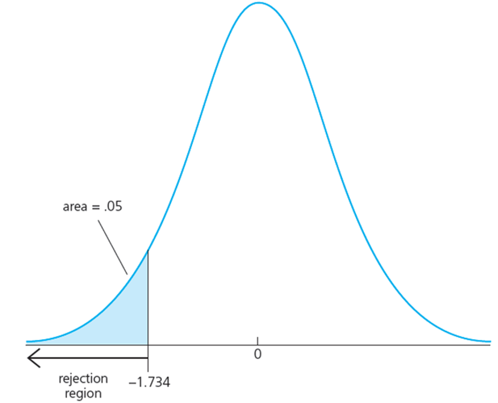
```

  - Reject the null hypothesis in favour of the alternative hypothesis if the estimated coefficient is “too small” (i.e. smaller than a critical value).

  - Construct the critical value so that, if the null hypothesis is true, it is rejected in, for example, 5% of the cases.

  - In the given example, this is the point of the t-distribution with 18 degrees of freedom so that 5% of the cases are below the point.

  - Reject if t-statistic is less than -1.734


---
### Example: Student performance and school size

Test whether smaller school size leads to better student performance

```{r, out.width="500px", fig.align = 'center'}
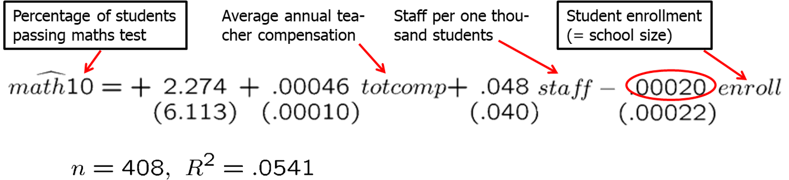
```

Do larger schools hamper student performance or is there no such effect?

Test $H_{0}: \beta_{\text {enroll }}=0$ against $H_{1}: \beta_{\text {enroll }}<0$


t-statistic

$t_enroll=\frac{-.00020}{.00022}\approx-.91$

$df=n-k-1=408-3-1=404$

Critical values for the 5% and the 15% significance level

$c_{0.05}=-1.65$

$c_{0.15}=-1.04$

We fail to reject the null hypothesis because the t-statistic is not smaller than the critical value


???
think if you want to cover the example in log form.. 
chapter 6 using R to choose the functional form


---
### b) Testing against Two-Sided Alternatives


```{r, out.width="500px", fig.align = 'center'}
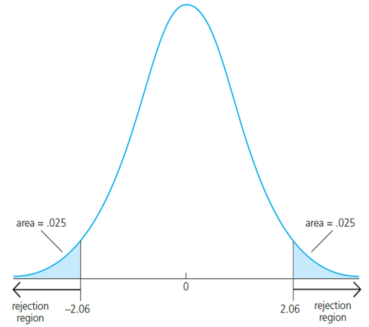
```


  - Reject the null hypothesis in favor of the alternative hypothesis if the absolute value of the estimated coefficient is too large

  - Construct the critical value so that, if the null hypothesis is true, it is rejected in, for example, 5% of the cases

  - In the given example, these are the points of the t-distribution so that 5% of the cases lie in the two tails

  - Reject if absolute value of t-statistic is less than -2.06 or greater than 2.06


---
### Example: Determinant of colllege GPA

```{r, out.width="500px", fig.align = 'center'}
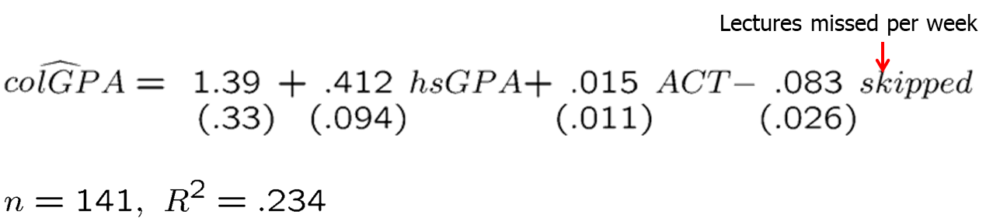
```


$t_{\text {hsGPA }}=4.38>c_{0.01}=2.58$
$t_{A C T}=1.36<c_{0.10}=1.645$
$\left|t_{\text {skipped }}\right|=|-3.19|>c_{0.01}=2.58$

The effects of `hsGPA` and `skipped` are significantly different from zero at the 1% significance level.

The effect of `ACT` is not significantly different from zero, not even at 10% significance level.

---
### “Statistically significant” variables in a regression


If a regression coefficient is different from zero in a two-sided test, the corresponding variable is said to be “statistically significant”.

If the number of degrees of freedom is large enough so that the normal approximation applies, the following rules of thumb apply:


  - $\mid t$ ratio $\mid>1.645 \longrightarrow$ "statistically significant at $10 \%$ level"
  - $\mid t$ ratio $\mid>1.96 \longrightarrow$ "statistically significant at $5 \%$ level"
  - $\mid t$ ratio $\mid>2.576 \longrightarrow$ "statistically significant at $1 \%$ level"


---
### c) Testing other hypothesis about $\beta_{j}$

Null hypothesis

$H_{0}: \beta_{j}=a_{j} \longleftarrow$ Hypothesized value of the coefficient


t-statistic

$t=\frac{(\text { estimate }-\text { hypothesized value })}{\text { standard error }}=\frac{\left(\widehat{\beta}_{j}-a_{j}\right)}{\operatorname{se}\left(\widehat{\beta}_{j}\right)}$

The test works exactly as before, except that the hypothesized value is substracted from the estimate when forming the statistic


---
### Example: Campus crime and enrollment


```{r, out.width="500px", fig.align = 'center'}

```


$$H_{0}: \beta_{\log (\text { enroll })}=1, H_{1}: \beta_{\log (\text { enroll })} \neq 1$$

$t=\frac{1.27-1}{.11} \approx 2.45>1.985=c_{0.05} \longleftarrow$ at the $5 \%$ level


---
### d) Computing P-values for t-tests 

Rather than testing at different significance levels is more informative to answer the question:
  - Given the value of the t- statistic, **what is the smallest significance level** at which the null hypothesis would be rejected? 
  - This is known as **P-value**
  
**The P-value is the probability of observing a t-statistic as extreme as we did if the null hypothesis is true**
  
  - If the significance level is made smaller and smaller, there will be a point where the null hypothesis cannot be rejected anymore.
  - The reason is that, by lowering the significance level, one wants to avoid more and more to make the error of rejecting a correct H0.
  - The smallest significance level at which the null hypothesis is still rejected, is called the p-value of the hypothesis test.
  - A small p-value is evidence against the null hypothesis because one would reject the null hypothesis even at small significance levels.
  - A large p-value is evidence in favor of the null hypothesis.
  - P-values are more informative than tests at fixed significance levels.
  

---
### Computing P-values for t-tests 


```{r, out.width="500px", fig.align = 'center'}
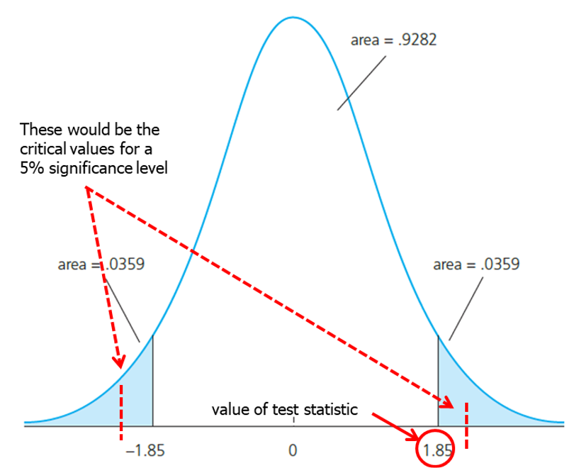
```

  - The p-value is the significance level at which one is indifferent between rejecting and not rejecting the null hypothesis. 

  - In the two-sided case, the p-value is thus the probability that the t-distributed variable takes on a larger absolute value than the realized value of the test statistic, e.g.
		P(|t|>1.85) = 2*(0.0359) = .0718

  - From this, it is clear that a null hypothesis is rejected if and only if the corresponding p-value is smaller than the significance level.

  - For example, for a significance level of 5% the t-statistic would not lie in the rejection region.


---
### e) Guidelines for discussing economic and statistical significance

  - If a variable is statistically significant, discuss the magnitude of the coefficient to get an idea of its economic or practical importance.

  - The fact that a coefficient is statistically significant does not necessarily mean it is economically or practically significant!

  - If a variable is statistically and economically important but has the “wrong” sign, the regression model might be misspecified.

  - If a variable is statistically insignificant at the usual levels (10%, 5%, or 1%), one may think of dropping it from the regression.

  - If the sample size is small, effects might be imprecisely estimated so that the case for dropping insignificant variables is less strong.


---
### 4.3 Confidence Intervals

A manipulation of the Theorem 4.2 
$$\frac{\widehat{\beta}_{j}-\beta_{j}}{\operatorname{se}\left(\widehat{\beta}_{j}\right)} \sim t_{n-k-1}$$
implies that


```{r, out.width="500px", fig.align = 'center'}
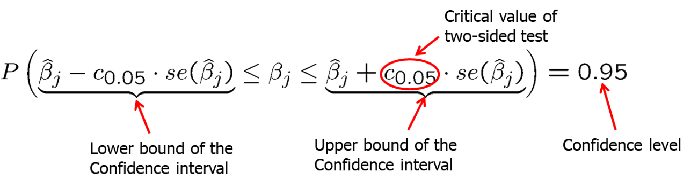
```

Interpretation of the confidence interval:
  - [The bounds of the interval are random. Simulations](https://professoramanda.github.io/econsimulations/))
  - In repeated samples, the interval that is constructed in the above way will cover the population regression coefficient in 95% of the cases


---
###Confidence intervals for typical confidence levels


$P\left(\widehat{\beta}_{j}-c_{0.01} \cdot \operatorname{se}\left(\widehat{\beta}_{j}\right) \leq \beta_{j} \leq \widehat{\beta}_{j}+c_{0.01} \cdot \operatorname{se}\left(\widehat{\beta}_{j}\right)\right)=0.99$
$\left.P\left(\widehat{\beta}_{j}-c_{0.05}\right) \cdot \operatorname{se}\left(\widehat{\beta}_{j}\right) \leq \beta_{j} \leq \widehat{\beta}_{j}+c_{0.05} \cdot \operatorname{se}\left(\widehat{\beta}_{j}\right)\right)=0.95$
$P\left(\widehat{\beta}_{j}-c_{0.10} \cdot \operatorname{se}\left(\widehat{\beta}_{j}\right) \leq \beta_{j} \leq \widehat{\beta}_{j}+c_{0.10} \cdot \operatorname{se}\left(\widehat{\beta}_{j}\right)\right)=0.90$

  - Use rules of thumb $c_{0.01}=2.576, c_{0.05}=1.96, c_{0.10}=1.645$


Relationship between confidence intervals and hypotheses tests


$a_{j} \notin$ interval $\Rightarrow$ reject $H_{0}: \beta_{j}=a_{j}$ in favor of $H_{1}: \beta_{j} \neq a_{j}$


---
### Example: Model of firms' R&D expenditures

```{r, out.width="500px", fig.align = 'center'}
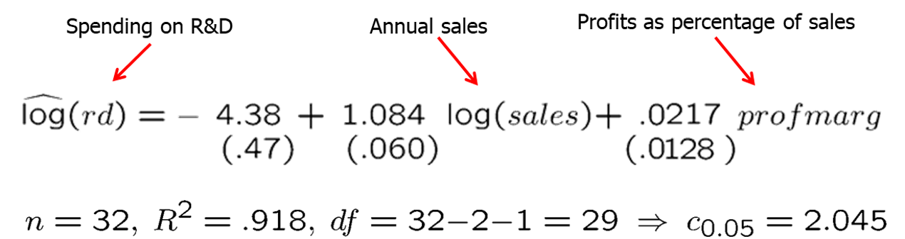
```


$$\begin{aligned}
&1.084 \pm 2.045(.060) \\
&=(.961,1.21)
\end{aligned}$$
The effect of sales on $R \& D$ is relatively precisely estimated as the interval is narrow. Moreover, the effect is significantly different from zero because zero is outside the interval.


$$\begin{aligned}
&.0217 \pm 2.045(.0218) \\
&=(-.0045, .0479)
\end{aligned}$$
This effect is imprecisely estimated as the interval is very wide. It is not even statistically significant because zero lies in the interval.


---
### 4.4 Testing hypotheses about a linear combination of the parameters

Example: Return to education at two-year vs. at four-year colleges


```{r, out.width="500px", fig.align = 'center'}

```

Test $H_{0}: \beta_{1}-\beta_{2}=0$ against $I I_{1}: \beta_{1}-\beta_{2}<0$


A possible test statistic would be:

The difference between the estimates is normalized by the estimated standard deviation of the difference.
The null hypothesis would have to be rejected if the statistic is "too negative" to believe that the true difference between the parameters is equal to zero.

$t=\frac{\left(\hat{\beta}_{1}-\hat{\beta}_{2}\right)}{\operatorname{se}\left(\widehat{\beta}_{1}-\bar{\beta}_{2}\right)}$

---


The standard error of the difference in parameters is impossible to with standard regression output

$\operatorname{se}\left(\widehat{\beta}_{1}-\widehat{\beta}_{2}\right)=\sqrt{\operatorname{Var}\left(\widehat{\beta}_{1}-\widehat{\beta}_{2}\right)}=\sqrt{\left.\operatorname{Var}\left(\widehat{\beta}_{1}\right)+\operatorname{Var}\left(\widehat{\beta}_{2}\right)-2 \operatorname{\operatorname {Cov}(\widehat {\beta }_{1},\widehat {\beta }_{2})}\right)}$


Usually not available in regression output:
$\operatorname {Cov}(\widehat {\beta }_{1},\widehat {\beta }_{2})}$ 


An alternative method is to make a substitution in variables.

Define $\theta_{1}=\beta_{1}-\beta_{2}$ and test $H_{0}: \theta_{1}=0$ against $H_{1}: \theta_{1}<0$.

$$\begin{aligned}
\log (\text { wage }) &\left.=\beta_{0}+\theta_{1}+\beta_{2}\right) j c+\beta_{2} u n i v+\beta_{3} \text { exper }+u \\
&=\beta_{0}+\theta_{1} j c+\beta_{2}(j c+u n i v)+\beta_{3} \text { exper }+u
\end{aligned}$$


---
### Estimation results


```{r,echo=TRUE,eval=TRUE}
data(twoyear, package='wooldridge')

res<-feols(lwage~ jc+univ+exper, data = twoyear)

modelsummary(res,output = "markdown")

```


---
### Estimation results


```{r,echo=TRUE,eval=FALSE}
data(twoyear, package='wooldridge')

res<-feols(lwage~ jc+univ+exper, data = twoyear)

modelsummary(res,output = "markdown")

```

```{r, out.width="500px", fig.align = 'center'}

```

$t=-.0102 / .0069=-1.48$

$p-$ value $=P(t-$ ratio $<-1.48)=.070$

$-.0102 \pm 1.96(.0069)=(-.0237, .0003)$

Note: This method works always for single linear hypotheses

---
### Testing multiple linear restrictions: The F-test

Multiple hypotheses: whether a group of variables has no effect on the dependent variables

```{r, out.width="500px", fig.align = 'center'}
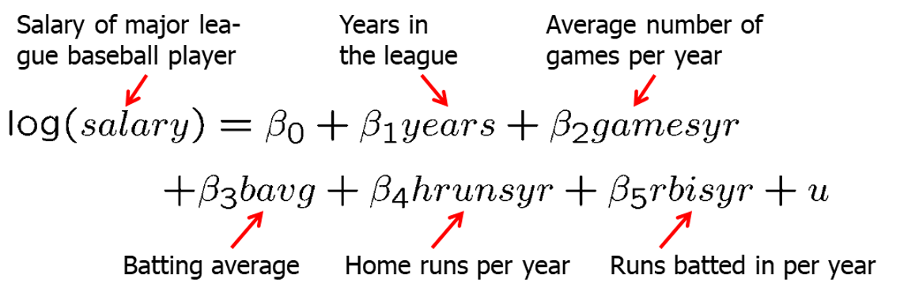
```

Test whether performance measures have no effect/ can be excluded from regression

$H_{0}: \beta_{3}=0, \beta_{4}=0, \beta_{5}=0$ against $H_{1}: H_{0}$ is not true


---
### Estimation of the unrestricted model

```{r, out.width="500px", fig.align = 'center'}
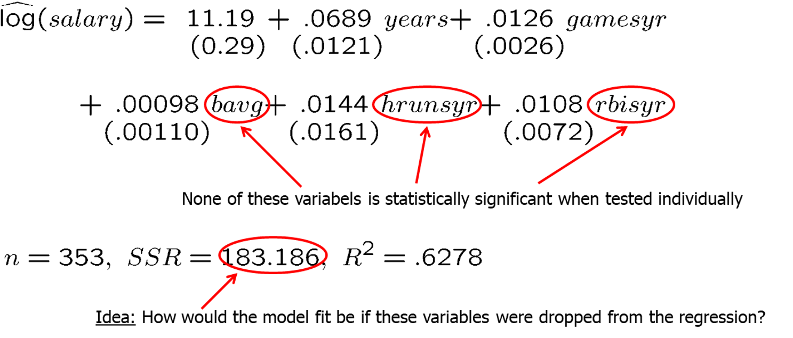
```

```{r, out.width="500px", fig.align = 'center'}

```

Test statistic:

$F=\frac{\left(S S R_{r}-S S R_{u r}\right) /()^{}}{S S R_{u r} /(n-k-1)} \sim F_{q, n-k-1}$

`q`- number of restrictions

`n-k-1`- The relative increase of the sum of squared residual when going from $H_1$ to $H_0$ follows a F- distribution (if the null hypothesis  $H_0$ is correct) 

---
### Rejection rule

```{r, out.width="500px", fig.align = 'center'}
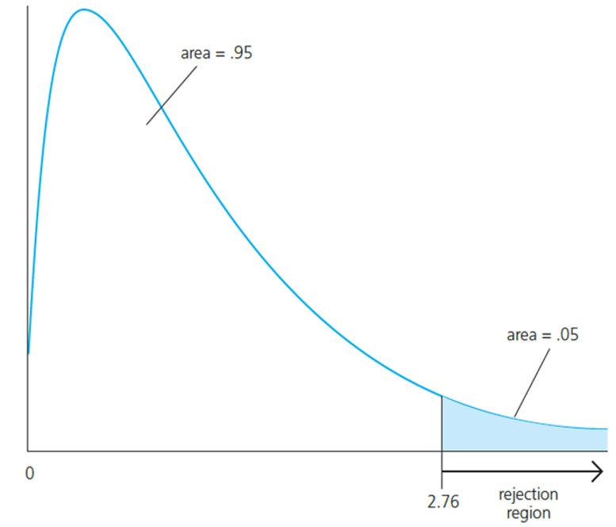
```

  - A F-distributed variable only takes on positive values. This corresponds to the fact that the sum of squared residuals can only increase if one moves from H1 to H0.

  - Choose the critical value so that we incorrectly reject the null hypothesis in, for example, only 5% of the cases.


---
### Test statistic

$F=\frac{\left(S S R_{r}-S S R_{u r}\right) /()^{}}{S S R_{u r} /(n-k-1)} \sim F_{q, n-k-1}$

```{r, out.width="500px", fig.align = 'center'}

```

$F=\frac{(198.311-183.186) / 3 }{183.186 /(353-5-1)} \approx 9.55$

$F \sim F_{3,347} \Rightarrow c_{0.01}=3.78$

$P(F-$ statistic $>9.55)=0.000$


Discussion:
  - The three variables are “jointly significant”
  - They were not significant when tested individually
  - The likely reason is multicollinearity between them


---

```{r, echo=TRUE,eval=TRUE}
data(mlb1, package='wooldridge')

# Unrestricted OLS regression
res.ur<- lm(log(salary)~ years+gamesyr+bavg+hrunsyr+rbisyr, data = mlb1)
# Restricted OLS regression
res.r<- lm(log(salary)~ years+gamesyr, data = mlb1)

# R^2
(r2.ur<-summary(res.ur)$r.squared)
r2.ur
(r2.r<-summary(res.r)$r.squared)
r2.r

# F statistic
(F<- (r2.ur-r2.r)/(1-r2.ur)*347/3)

#p value=1-CDF of the appropiate F distribution
1-pf(F,3,347)


```


---
### Test of overall significance of a regression


$y=\beta_{0}+\beta_{1} x_{i 1}+\beta_{2} x_{i 2}+\ldots+\beta_{k} x_{i k}+u$

$H_{0}: \beta_{1}=\beta_{2}=\ldots=\beta_{k}=0 \longleftarrow \begin{aligned}&\text { The null hypothesis states that the explanatory } \\&\text { variables are not useful at all in explaining the } \\&\text { dependent variable }\end{aligned}$

$y=\beta_{0}+u \leftarrow \begin{aligned}&\text { Restricted model } \\&\text { (regression on constant) }\end{aligned}$

$F=\frac{\left(S S R_{r}-S S R_{u r}\right) / q}{S S R_{u r} /(n-k-1)}=\frac{R^{2} / k}{\left(1-R^{2}\right) /(n-k-1)} \sim F_{k, n-k-1}$

Discussion
  - The three variables are “jointly significant”
  - They were not significant when tested individually
  - The likely reason is multicollinearity between them


---
### Testing general linear restrictions with the F-test


Example: Test whether house price assessments are rational


```{r, out.width="500px", fig.align = 'center'}
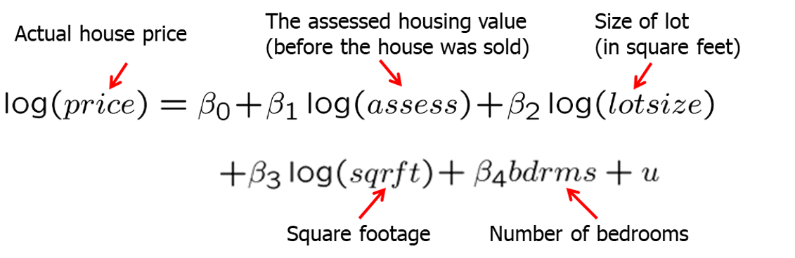
```

If house price assessments are rational, a 1% change in the assessment should be associated with a 1% change in price.
In addition, other known factors should not influence the price once the assessed values has been controlled for.


$H_{0}: \beta_{1}=1, \beta_{2}=0, \beta_{3}=0, \beta_{4}=0$

---
### Testing general linear restrictions with the F-test

Unrestricted regression

$\log ($ price $)=\beta_{0}+\beta_{1} \log ($ assess $)+\beta_{2} \log (\operatorname{lotsize})+\beta_{3} \log (\operatorname{sqrft})+\beta_{4} b d r m s+u$

Restricted regression

The restricted model is actually a regression of $log(price)-log(assess)$ on a constant

$\log ($ price $)=\beta_{0}+\log ($ assess $)+u$
$\log ($ price $)-\log ($ assess $)=\beta_{0}+u$


Test Statistic

$F=\frac{\left(S S R_{r}-S S R_{u r}\right) / q}{S S R_{u r} /(n-k-1)}=\frac{(1.880-1.822) / 4}{1.822 /(88-4-1)} \approx .661$
$F \sim F_{4,83} \Rightarrow c_{0.05}=2.50 \Rightarrow H_{0}$ cannot be rejected


