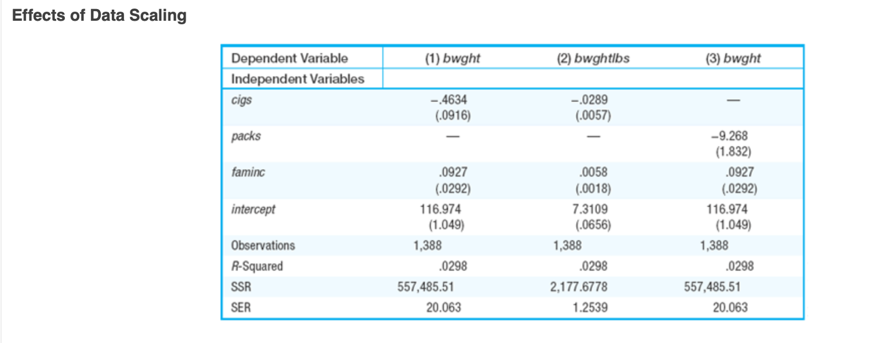
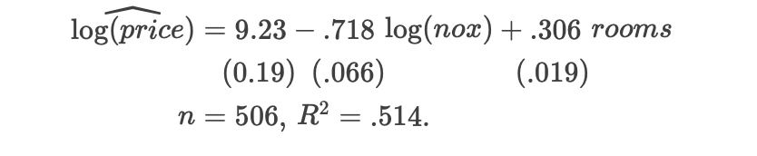
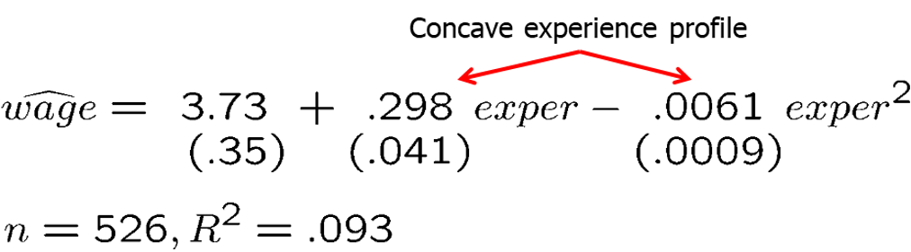
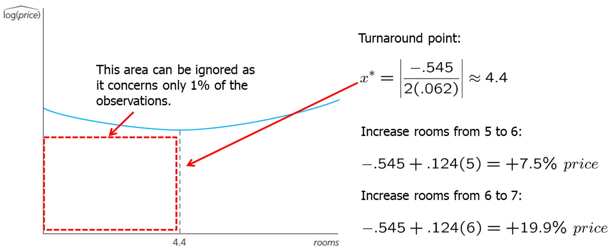
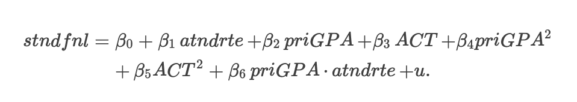
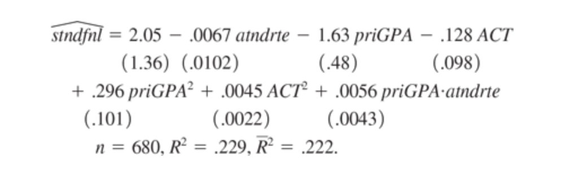

```{r setup, include=FALSE}
options(htmltools.dir.version = FALSE) 
knitr::opts_chunk$set(echo = FALSE, warning = FALSE, message = FALSE, fig.width = 8, fig.height = 6)
library(tidyverse)
library(gghighlight)
library(jtools)
library (wooldridge) # need to load the package before using it
library(fixest) # needed to run the regression feols
library(modelsummary)
library(magrittr)

```


``` {r xaringan-themer, include=FALSE, warning=FALSE}
# install.packages("remotes")
#remotes::install_github('rstudio/chromote')
#remotes::install_github("jhelvy/xaringanBuilder")

library(xaringanBuilder)
library(xaringanthemer)
style_duo_accent(
 # primary_color = "#1381B0",
  primary_color = "#006600", # color first slide and titles
  secondary_color = "#FF961C",
  inverse_header_color = "#FFFFFF"  #white
)

#this to build PDF :)
#build_pdf('https://github.com/andrahiriscau/Econometrics_Slides/blob/main/Lecture_1/Econometrics.html')
#build_pdf('https://andrahiriscau.github.io/Econometrics_Slides/Chapter_2/Chapter_2.html')


```


## 6.1 Effects of data scaling on OLS statistics


**Dependent Variables**

$\widehat{b w g h} t=\hat{\beta}_{0}+\hat{\beta}_{1}$ cigs $+\hat{\beta}_{2}$ faminc

  - bwght $=$ child birth weight, in ounces.
  - cigs $=$ number of cigarettes smoked by the mother while pregnant, per day.
  - faminc $=$ annual family income, in thousands of dollars.

$\widehat{\text { bwght }} 16=\hat{\beta}_{0} / 16+\left(\hat{\beta}_{1} / 16\right)$ cigs $+\left(\hat{\beta}_{2} / 16\right)$ faminc $.$


```{r, out.width="500px", fig.align = 'center'}

```

When variables are re-scaled, the coefficients, standard errors, confidence intervals, t statistic and F statistic changes in a way that preserve the testing outcome.


----
### Data scaling of independent variables

Define $packs=\frac{cigs}{20}$

$\widehat{\text { bwght }}=\hat{\beta}_{0}+\left(20 \hat{\beta}_{1}\right)($ cigs $/ 20)+\hat{\beta}_{2}$ faminc $=\hat{\beta}_{0}+\left(20 \hat{\beta}_{1}\right)$ packs $+\hat{\beta}_{2}$ faminc.

```{r, out.width="500px", fig.align = 'center'}

```

 - the coefficient on `packs` is 20 times that on `cigs`
 - standard error on `packs` is 20 times that on `cigs`
 - this means that `t-statistics` is the same in both cases
 
 Changing the unit of measurement of the dependent variable, when it appears in logarithmic form, does not affect any of the slope estimates.


---
### Standardizing the variables (Beta coefficients)

The test scores are used in wage equations, and the scale of these test scores is often arbitrary and not easy to interpret 

We are interested in how a particular individual's score compares with the population:
  - instead of asking about the effect on hourly wage if say a test score is 10 point higher, it makes more sense to ask what happends when the test score is **one standard deviation** higher.
    
Standardizing all variables

1. Original form 

$y_{i}=\hat{\beta}_{0}+\hat{\beta}_{1} x_{i 1}+\hat{\beta}_{2} x_{i 2}+\ldots+\hat{\beta}_{k} x_{i k}+\hat{u}_{i}$

2. Subtract the mean 

$y_{i}-\bar{y}=\hat{\beta}_{1}\left(x_{i 1}-\bar{x}_{1}\right)+\hat{\beta}_{2}\left(x_{i 2}-\bar{x}_{2}\right)+\ldots+\hat{\beta}_{k}\left(x_{i k}-\bar{x}_{k}\right)+\hat{u}_{i}$

3. Let $\hat{\sigma}_i$ be the sample standard deviation for each variable

$\left(y_{i}-\bar{y}\right) / \hat{\sigma}_{y}=\left(\hat{\sigma}_{1} / \hat{\sigma}_{y}\right) \hat{\beta}_{1}\left[\left(x_{i 1}-\bar{x}_{1}\right) / \hat{\sigma}_{1}\right]+\ldots+\left(\hat{\sigma}_{k} / \hat{\sigma}_{y}\right) \hat{\beta}_{k}\left[\left(x_{i k}-\bar{x}_{k}\right) / \hat{\sigma}_{k}\right]+\left(\hat{u}_{i} /\hat{\sigma}_{y}\right)$

---


$\left(y_{i}-\bar{y}\right) / \hat{\sigma}_{y}=\left(\hat{\sigma}_{1} / \hat{\sigma}_{y}\right) \hat{\beta}_{1}\left[\left(x_{i 1}-\bar{x}_{1}\right) / \hat{\sigma}_{1}\right]+\ldots+\left(\hat{\sigma}_{k} / \hat{\sigma}_{y}\right) \hat{\beta}_{k}\left[\left(x_{i k}-\bar{x}_{k}\right) / \hat{\sigma}_{k}\right]+\left(\hat{u}_{i} /\hat{\sigma}_{y}\right)$

It is useful to rewrite the equation above as: 

$z_{y}=\hat{b}_{1} z_{1}+\hat{b}_{2} z_{2}+\ldots+\hat{b}_{k} z_{k}+$ error

where $z_{y}$ denotes the $z$-score of $y, z_{1}$ is the $z$-score of $x_{1}$, and so on. The new coefficients are

$$\hat{b}_{j}=\left(\hat{\sigma}_{j} / \hat{\sigma}_{y}\right) \hat{\beta}_{j} \text { for } j=1, \ldots, k$$

$\hat{b}_{j}$ are traditionally called **standardized coefficients** or **beta coefficients**


Beta coefficients receive their interesting meaning from equation above: if $x_{1}$ increases by one standard deviation, then $\hat{y}$ changes by $\hat{b}_{1}$ standard deviations. Thus, we are measuring effects not in terms of the original units of $y$ or the $x_{j}$, but in standard deviation units. 

---

### Example 

Example 6.1: Effects of pollution on housing prices

Level- level model:

price $=\beta_{0}+\beta_{1}$ nox $+\beta_{2}$ crime $+\beta_{3}$ rooms $+\beta_{4}$ dist $+\beta_{5}$ stratio $+u$

where `crime` is the number of reported crimes per capita


Standardized model:

$\widehat{\text { zprice }}=-.340$ znox $-.143$ zcrime $+.514$ zrooms $-.235$ zdist $-.270$ zstratio.

Interpretation:
  - a one standard deviation increase in `nox` decreases price by .34 standard deviation
  - a one standard deviation increase in `crime` reduces price by .14 standard deviation
  
Whether we use standardize or unstandardized variables does not affect statistical significance: the **t statistics** are the same in both cases


---
### 6.2 More on functional form

## a) More on using logarithmic functional form


$\log ($ price $)=\beta_{0}+\beta_{1} \log ($ nox $)+\beta_{2}$ rooms $+u$

```{r, out.width="500px", fig.align = 'center'}

```

Thus, wen `nox` increases by 1% `price` falls by .718% holding only `rooms` fixed.

When `rooms` increases by one, `price` increases by approximately $100(.306)=30.6\%$ 

To calculate the exact change


$$\% \Delta \hat{y}=100 \cdot\left[\exp \left(\hat{\beta}_{2} \Delta x_{2}\right)-1\right]$$

when $\Delta x_2=1$

$$\% \Delta \hat{y}=100 \cdot\left[\exp \left(\hat{\beta}_{2}\right)-1\right]$$

Applied to the housing price example with $x_{2}=$ rooms and $\hat{\beta}_{2}=.306$,
$\% \Delta \widehat{\text { price }}=100[\exp (.306)-1]=35.8 \%$, which is notably larger than the approximate percentage change 30.6%.


???
chapter 2.4 we had education and wage example....

---
### More on using logarithmic functional form

Reasons why logarithmic form appears in applied work:
  - coefficients have appealing interpretations
  - we can ignore the units of measurement of variables
  - strictly positive variables often have distribution that are heteroskedastic or skewed; taking the log can mitigate, if not, eliminate both problems
  - taking the log of variables often narrows its range which makes the OLS estimates less sensitive to outliers (extreme values)
  
Caution:
  - it can create extreme values cases.  An example is when a variable $y$ is between zero and one (such as a proportion) and takes on values close to zero. In this case, $\log (y)$ (which is necessarily negative) can be very large in magnitude whereas the original variable, $y$, is bounded between zero and one.
  
  
---
### More on using logarithmic functional form
  
  
Unwritten rules:

  - When a variable is a positive dollar amount, the log is often taken. We have seen this for variables such as wages, salaries, firm sales, and firm market value. 
  
  - Variables such as population, total number of employees, and school enrollment often appear in logarithmic form; these have the common feature of being large integer values.
  
  
  
Review: distinction between a percentage change and a percentage point change

  - Remember, if `unem` goes from 8% to 9% , this is an increase of one percentage point, but a $12.5 \%$ increase from the initial unemployment level. Using the log means that we are looking at the percentage change in the unemployment rate:
$\log (9)-\log (8) \approx .118$ or $11.8 \%$, which is the logarithmic approximation to the actual $12.5 \%$ increase.
  
  

---
### b) Model with quadratics

  Quadratic functions  are also used quite often in applied economics to capture decreasing or increasing marginal effects
  
Model:

$y=\beta_{0}+\beta_{1} x+\beta_{2} x^{2}+u .$

Remember, that $\beta_1$ does not measure the change in `y` with respect to `x` ; it makes no sense to hold $x^2$ fixed while changing $x$

Estimated equation:

$\hat{y}=\hat{\beta}_{0}+\hat{\beta}_{1} x+\hat{\beta}_{2} x^{2}$


$\Delta \hat{y} \approx\left(\hat{\beta}_{1}+2 \hat{\beta}_{2} x\right) \Delta x$, so $\Delta \hat{y} / \Delta x \approx \hat{\beta}_{1}+2 \hat{\beta}_{2} x$

The estimated slope is $ \hat{\beta}_{1}+2 \hat{\beta}_{2} x$

---
### Example

```{r, out.width="500px", fig.align = 'center'}

```

- Marginal effect of experience

$\frac{\Delta \text { wage }}{\text { sexper }}=.298-2(.0061)$ exper


This estimated equation implies that `exper` has a diminishing effect on `wage`. The first year of experience is worth roughly 30¢ per hour ($.298). 

The second year of experience is worth less $.298-2(.0061)(1) \approx .286$, or $28.6 \mathrm{C}$

In going from 10 to 11 years of experience, wage is predicted to increase by about $.298-2(.0061)(10)=.176$, or $17.6 \%$


???
review math refresher A


---

When the coefficient on $x$ is positive and the coefficient on $x^2$ is negative, the quadratic has a parabolic shape (concave).

There is always a positive value of $x$  where the effect of $x$  on $y$ is zero; before this point, $x$  has a positive effect on $y$; after this point, $x$  has a negative effect on $y$.

How can we find the turning point?

$$x^{*}=|\frac{\hat{\beta}_{1}}{2 \hat{\beta}_{2}}| $$

In the wage example, $x^{*}=$ `exper` $^{*}$ is $.298 /[2(.0061)] \approx 24.4$

---


```{r, out.width="500px", fig.align = 'center'}

```

  - Does this mean the return to experience becomes negative after 24.4 years?

  - Not necessarily. It depends on how many observations in the sample lie to the right of the turnaround point.

  - In the given example, these are about 28% of the observations. There may be a specification problem (e.g. omitted variables). 


---
### Example: Effects of pollution on housing prices

When the coefficient on $x$ is negative and the coefficient on $x^2$ is positive, the quadratic has a convex shape. Increasing effect of $x$ on $y$.


$\log ($ price $)=\beta_{0}+\beta_{1} \log ($ nox $)+\beta_{2} \log ($ dist $)+\beta_{3}$ rooms $+\beta_{4}$ rooms ${ }^{2}+\beta_{5}$ stratio $+u .$

```{r, out.width="500px", fig.align = 'center'}

```


Does this mean that, at a low number of rooms, more rooms are associated with lower prices?

$\frac{\Delta \log (\text { price })}{\Delta \text { rooms }}=\frac{\% \Delta \text { price }}{\Delta \text { rooms }}=-.545+.124$ rooms


---
### Example: Effects of pollution on housing prices

```{r, out.width="500px", fig.align = 'center'}

```

The coefficient on `rooms` is negative and the coefficient on `rooms^2` is positive, this equation literally implies that, at low values of rooms, an additional room has a negative effect on `log(price)`

Do we really believe that starting at three rooms and increasing to four rooms actually reduces a house’s expected value? Probably not. 
  -  It turns out that only five of the 506 communities in the sample have houses averaging 4.4 rooms or less, about 1% of the sample. This is so small that the quadratic to the left of 4.4 can, for practical purposes, be ignored.

$$\begin{aligned}
\% \Delta \text { price } & \approx 100\{[-.545+2(.062)] \text { rooms }\} \Delta \text { rooms } \\
&=(-54.5+12.4 \text { rooms }) \Delta \text { rooms. }
\end{aligned}$$

Thus, an increase in rooms from, say, five to six increases price by about $-54.5+12.4(5)=7.5 \%$; the increase from six to seven increases price by roughly $-54.5+12.4(6)=19.9 \%$. This is a very strong increasing effect.

---
### c) Models with interaction terms

Sometimes, it is natural for the dependent variable with respect to an explanatory variable to depend on the magnitude of yet another explanatory variable.

$$price =\beta_{0}+\beta_{1} s q r f t+\beta_{2} b d r m s+\beta_{3} s q r f t \cdot b d r m s+\beta_{4} b t h r m s+u$$

  - The partial effect of `bdrms` on `price` (holding all other variables fixed) is

$$\frac{\Delta \text { price }}{\Delta b d r m s}=\beta_{2}+\beta_{3} s q r f t$$

If $\beta_3>0$, then it implies that an additional bedroom yields a higher increase in housing price for larger houses

In other words, there is an interaction effect  between `square footage` and `number of bedrooms`. 

In summarizing the effect of `bdrms` on `price`, we must evaluate the equation above at interesting values of `sqrft`, such as the mean value, or the lower and upper quartiles in the sample

**The parameters on the original variables can be tricky to interpret when we include an interaction term.**
  - For example, in the previous housing price equation, equation shows that $\beta_2$ is the effect of `bdrms` on price for *a home with zero square feet*


---
### Example 6.3: Effects of attendance on final exam performance

```{r, out.width="500px", fig.align = 'center'}

```

--

```{r, out.width="500px", fig.align = 'center'}

```


---
```{r,echo=TRUE,eval=TRUE}

data(attend, package='wooldridge')

# Regression
model_1 <- feols(data=attend, stndfnl ~ atndrte+priGPA+ACT+priGPA^2+ACT^2+priGPA*atndrte)
summary(model_1)

```


???
check the interpretation example 6.3

---

If we add the term $\beta_7$ `ACT·atndrte` to equation (6.18), what is the partial effect of `atndrte` on `stndfnl`?

--
The new model would be
stndfnl $=\beta_{0}+\beta_{1}$ atndrte $+\beta_{2}$ priGP $A+\beta_{3} A C T+\beta_{4}$ priGP $A^{2}+\beta_{5} A C T^{2}+\beta_{6}$ priGPA atndrte $+\beta_{7} A C T \cdot$ atndrte $+u$ . 

Therefore, the partial effect of atndrte on stndfnl is
$\beta_{1}+\beta_{6}$ priGPA $+\beta_{7} \mathrm{ACT}$. This is what we multiply by $\Delta$ atndrte to obtain the ceteris paribus change in stndfnl.


---
```{r,echo=TRUE,eval=TRUE}

data(wage1, package='wooldridge')

# Regression
model_1 <- lm(wage ~ educ, wage1)
#summary(model_1)
wage1 %<>% mutate(wagehat1 = fitted(model_1))
ggplot(data = wage1, mapping = aes(x = educ)) + 
  theme_bw() +
  geom_point(mapping = aes(y = wage, col = 'wage')) +
  geom_point(mapping = aes(y = wagehat1, col = 'linear prediction'))


```

---

```{r}
data(wage1, package='wooldridge')

wage1 %<>% mutate(educsq = educ^2)
model_2 <- lm(wage ~ educ + educsq, wage1)
#summary(model_2)
wage1 %<>% mutate(wagehat2 = fitted(model_2))
ggplot(data = wage1, mapping = aes(x = educ)) + 
  theme_bw() +
  geom_point(mapping = aes(y = wage, col = 'wage')) +
  geom_point(mapping = aes(y = wagehat2, col = 'linear prediction'))


```