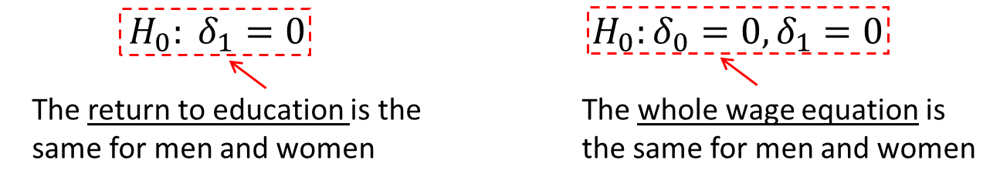
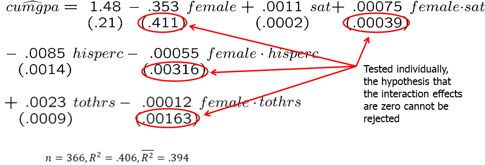
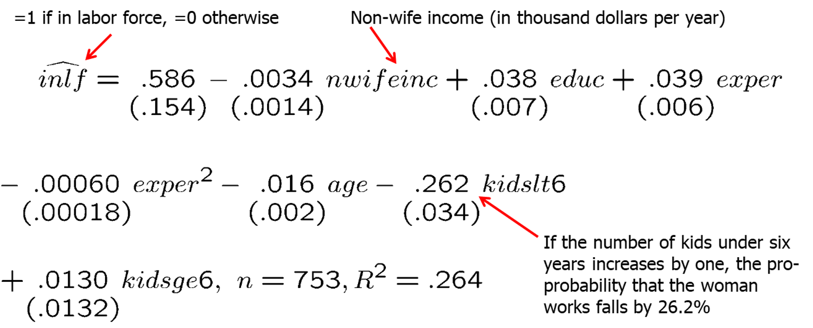
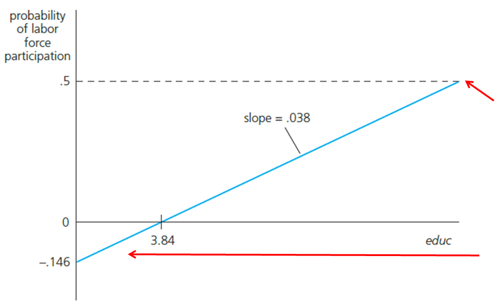

```{r setup, include=FALSE}
options(htmltools.dir.version = FALSE) 
knitr::opts_chunk$set(echo = FALSE, warning = FALSE, message = FALSE, fig.width = 8, fig.height = 6)
library(tidyverse)
library(gghighlight)
library(jtools)
library (wooldridge) # need to load the package before using it
library(fixest) # needed to run the regression feols
library(modelsummary)
library(magrittr)
library(stargazer)

```


``` {r xaringan-themer, include=FALSE, warning=FALSE}
# install.packages("remotes")
#remotes::install_github('rstudio/chromote')
#remotes::install_github("jhelvy/xaringanBuilder")

library(xaringanBuilder)
library(xaringanthemer)
style_duo_accent(
 # primary_color = "#1381B0",
  primary_color = "#006600", # color first slide and titles
  secondary_color = "#FF961C",
  inverse_header_color = "#FFFFFF"  #white
)

#this to build PDF :)
#build_pdf('https://github.com/andrahiriscau/Econometrics_Slides/blob/main/Lecture_1/Econometrics.html')
#build_pdf('https://andrahiriscau.github.io/Econometrics_Slides/Chapter_2/Chapter_2.html')


```


## 7.1 Describing Qualitative Information

Examples: gender, race, industry, region, rating grade...
A way to incorporate qualitative information is to use dummy variables.
They may appear as the dependent or as independent variables

A single dummy independent variable

```{r, out.width="500px", fig.align = 'center'}

```

---
## 7.2 A Single Dummy Independent Varible


wage $=\beta_{0}+\delta_{0}$ female $+\beta_{1} e d u c+u .$

$\delta_{0}=\mathrm{E}($ wage $\mid$ female $=1, e d u c)-\mathrm{E}($ wage $\mid$ female $=0, e d u c)$


$\delta_{0}=\mathrm{E}($ wage $\mid$ female, educ $)-\mathrm{E}($ wage $\mid$ male, educ $)$

The key here is that the level of education is the same in both expectations; the difference, $\delta_0$, is due to gender only.


```{r, out.width="500px", fig.align = 'center'}

```

---
### Dummy variable trap

Why don't we include a dummy variable, say `male`, which is one for males and zero for females?


wage $=\beta_{0}+\gamma_{0}$ male $+\delta_{0}$ female $+\beta_{1} e d u c+u$

This model cannot be estimated due to perfect collinearity.

The **dummy variable trap** refers to the problem that not all categories can be included in the regression and one category needs to be left out, which is called a base or reference category.


When using dummy variables, one category always has to be omitted:


wage $=\beta_{0}+\delta_{\alpha}$ female $+\beta_{1} e d u c+u$

Base category: men

wage $=\beta_{0}+\gamma_{0}$ male $+\beta_{1} e d u c+u$

Base category: women

---
Alternatively, one could omit the intercept

wage $=\gamma_{0}$ male $+\delta_{0}$ female $+\beta_{1} e d u c+u$

Disadvantages:
1. More difficult to test for differences between the parameters.
2. R-squared formula invalid without an intercept


---
```{r,echo=FALSE,eval=FALSE}

data(wage1, package='wooldridge')

# Average wage
#lm(wage ~ 1, wage1) %>% summary
#wage1 %>% select(wage) %>% stargazer(type = "text")

# Regression of wage on female
#lm(wage ~ female, wage1) %>% summary

# Graph of wage on female
ggplot(wage1, aes(x = female, y = wage)) +
  theme_bw() +
  geom_point() +
  geom_smooth(aes(col = 'fitted line'), method = "lm", se = F)


```


---
### Comparing means of subpopulations described by dummies


```{r, out.width="500px", fig.align = 'center'}

```

Regression 1: Females have $2.51 lower wages than males. The reference category is male.

Regression 2: Males have $2.51 higher wages than females. The reference category is female.

The intercept or average wage for females is $4.59=\hat{\beta}_{0}+\hat{\delta}_{0}=7.10-2.51$.

The intercept or average wage for males is $7.10=\hat{\beta}_{0}+\hat{\delta}_{0}-\hat{\delta}_{0}=4.59+2.51$.

Regression 3: both female and male are included but there is no constant. The coefficients are the average wage for females and males.


---
### Example: Effects of training grants on hours of training

```{r, out.width="500px", fig.align = 'center'}

```

This is an example of program evaluation
  - Treatment group (= grant receivers) vs. control group (= no grant)
  - Is the effect of treatment on the outcome of interest causal?

---
### Using dummy explanatory variables in equations for log(y)


```{r, out.width="500px", fig.align = 'center'}

```

$\frac{\Delta \log (\text { price })}{\Delta \text { colonial }}=\frac{\% \Delta \text { price }}{\% \Delta \text { colonial }}=5.4 \%$

As the dummy for colonial style changes from 0 to 1, the house price increases by 5.4 percentage points.


---
## 7.3 Dummy Variables for Multiple Categories
7.4 interactions among dummy variables

Interaction terms for variables `female` and `married` can be done in two different ways.


  1. Create four categories: `female*single`, `male*single`, `female*married`, and `male*married` and include 3 of them in the regression model (the fourth/omitted category serves as a base/reference category).

wage $=\beta_{0}+\beta_{1}$ female $*$ single $+\beta_{2}$ female $*$ married $+\beta_{3}$ male $*$ married $+u$

Reference category: single male


  2. Include `female` and `married` and  `female*married` in the regression.

wage $=\beta_{0}+\beta_{1}$ female $+\beta_{2}$ married $+\beta_{3}$ female $*$ married $+u$

???

look at the data for the interaction terms
---
### Interaction terms with indicator variables

```{r,echo=TRUE,eval=TRUE}

data(wage1, package='wooldridge')
# Generate indicator variables
wage1 %<>% mutate(single = 1 - married)
wage1 %<>% mutate(male = 1 - female)
# Categories: female*single, male*single, female*married, male*married
wage1 <-wage1 %>%
                  mutate(female_single  = female*single,
                    male_single  =   male*single,
                  female_married = female*married,
                    male_married =   male*married)

wage1 %>% 
  select(female, male, single, married, female_single, male_single,
         female_married, male_married) %>%
  head(10)
```

---
```{r,echo=TRUE,eval=TRUE}

# Regression with male_single as reference category
model_1 <- lm(wage ~ female_single + female_married + male_married, wage1)

# Regression with interaction term
model_2 <- lm(wage ~ female + married + female*married, wage1)

models <- list(model_1, model_2)
modelsummary(models,output = "markdown")

```


---
### Incorporating ordinal information using dummy variables

Example: City credit ratings and municipal bond interest rates

```{r, out.width="500px", fig.align = 'center'}

```

```{r, out.width="500px", fig.align = 'center'}

```


---
### Interactions involving dummy variables and continuous variables

$\log ($ wage $)=\beta_{0}+\delta_{0}$ female $+\beta_{1}$ educ $+\delta_{1}$ female $\cdot$ educ $+u$

$\begin{array}{ll}\beta_{0}=\text { intercept for men } & \beta_{1}=\text { slope for men } \\ \delta_{0}=\text { intercept for women } & \delta_{1}=\text { slope for women }\end{array}$


Interesting hypothesis

```{r, out.width="500px", fig.align = 'center'}

```

---

### Graphical illustration

```{r, out.width="500px", fig.align = 'center'}

```

Interacting both the intercept and the slope with the female dummy enables one to model completely independent wage equations for men and women.


---
### Example:Estimated wage equation with interaction term
 

```{r, out.width="500px", fig.align = 'center'}

```


???
No evidence against hypothesis that the return to education is the same for men and women.
Does this mean that there is no significant evidence of lower pay for women at the same levels of educ, exper, and tenure? No: this is only the effect for educ = 0. To answer the question one has to recenter the interaction term, e.g. around educ = 12.5 (= average education).

---
### Testing for Differences in Regression Functions across Groups


Unrestricted model (contains full set of interactions)

cumgpa $=\beta_{0}+\delta_{0}$ female $+\beta_{1}$ sat $+\delta_{1} f$ emale sat $+\beta_{2}$ hsperc$+\delta_{2}$ female $\cdot h s p e r c+\beta_{3}$ tothrs $+\delta_{3}$ female tothrs $+u$


Restricted model (same regression for both groups)

cumgpa $=\beta_{0}+\beta_{1}$ sat $+\beta_{2}$ hsperc $+\beta_{3}$ tothrs $+u$


---

Null hypothesis

All interaction effects are zero i.e. the same regression coefficients apply to men and women

$H_{0}: \delta_{0}=0, \delta_{1}=0, \delta_{2}=0, \delta_{3}=0$


Estimation of the unrestricted model

```{r, out.width="500px", fig.align = 'center'}

```

---

Joint test with F-statistic

Null hypothesis is rejected

$F=\frac{\left(S S R_{P}-S S R_{u r}\right) / q}{S S R_{u r} /(n-k-1)}=\frac{(85.515-78.355) / 4}{78.355 /(366-7-1)} \approx 8.18$


---
### Chow test
Alternative way to compute F-statistic in the given case
 
  - Run separate regressions for men and for women; the unrestricted SSR is given by the sum of the SSR of these two regressions.
  - Run regression for the restricted model and store SSR.
  - If the test is computed in this way it is called the Chow-Test.
  - Important: Test assumes a constant error variance across groups.


$F=\frac{\left[\mathrm{SSR}_{p}-\left(\mathrm{SSR}_{1}+\mathrm{SSR}_{2}\right)\right]}{\mathrm{SSR}_{1}+\mathrm{SSR}_{2}} \cdot \frac{[n-2(k+1)]}{k+1}$

where `k` represents the number of interaction terms.


---
### 7.5 A Binary Dependent Variable: the Linear Probability Model

$$y=\beta_{0}+\beta_{1} x_{1}+\ldots+\beta_{k} x_{k}+u$$

$$E(y \mid \mathbf{x})=\beta_{0}+\beta_{1} x_{1}+\ldots+\beta_{k} x_{k}$$

If the dependent variable only take on the values 1 and 0
$$E(y \mid \mathbf{x})=1 \cdot P(y=1 \mid \mathbf{x})+0 \cdot P(y=0 \mid \mathbf{x})$$

Linear Probability Model (LPM)
$$P(y=1 \mid \mathbf{x})=\beta_{0}+\beta_{1} x_{1}+\ldots+\beta_{k} x_{k}$$

$$\beta_{j}=\Delta P(y=1 \mid \mathrm{x}) / \Delta x_{j}$$
In the linear probability model, the coefficients describe the effect of the explanatory variables on the probability that $y=1$


---
### Example: Labor force participation of married women


```{r, out.width="500px", fig.align = 'center'}

```

---

Graph for `nwifeinc=50`, `exper=5`, `age=30`, `kindslt6=1`, and `kidsge6=0`

```{r, out.width="500px", fig.align = 'center'}

```

The maximum level of education in the sample is educ=17. For the given case, this leads to a predicted probability to be in the labor force of about 50%.


There is a negative predicted probability, but no problem because no woman in the sample has educ < 5.


---

Disadvantages of the linear probability model
  - Predicted probabilities may be larger than one or smaller than zero.
  - Marginal probability effects sometimes logically impossible.
  - The linear probability model is necessarily heteroskedastic.
  - Thus, heteroskedasticity consistent standard errors need to be computed.


$\operatorname{Var}(y \mid \mathbf{x})=P(y=1 \mid \mathbf{x})[1-P(y=1 \mid \mathbf{x})]$


Advantages of the linear probability model
  - Easy estimation and interpretation
  - Estimated effects and predictions are often reasonably good in practice.


