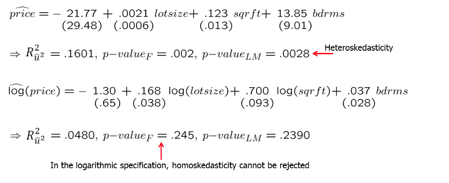
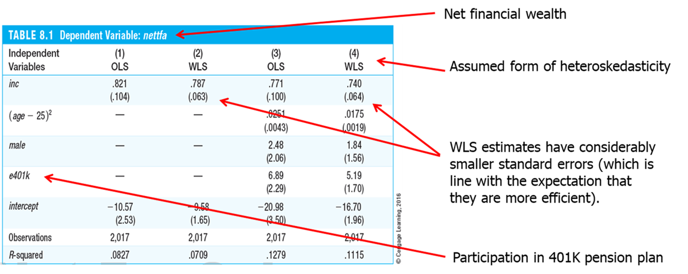
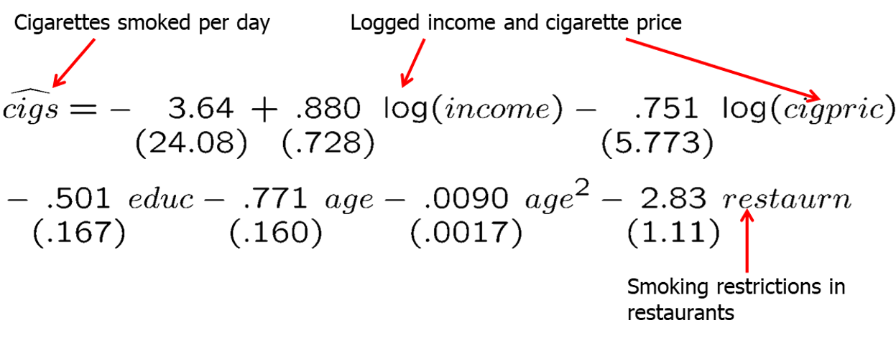
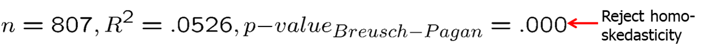

```{r setup, include=FALSE}
options(htmltools.dir.version = FALSE) 
knitr::opts_chunk$set(echo = FALSE, warning = FALSE, message = FALSE, fig.width = 8, fig.height = 6)
library(tidyverse)
library(gghighlight)
library(jtools)
library (wooldridge) # need to load the package before using it
library(fixest) # needed to run the regression feols
library(modelsummary)
library(magrittr)
library(stargazer)

```


``` {r xaringan-themer, include=FALSE, warning=FALSE}
# install.packages("remotes")
#remotes::install_github('rstudio/chromote')
#remotes::install_github("jhelvy/xaringanBuilder")

library(xaringanBuilder)
library(xaringanthemer)
style_duo_accent(
 # primary_color = "#1381B0",
  primary_color = "#006600", # color first slide and titles
  secondary_color = "#FF961C",
  inverse_header_color = "#FFFFFF"  #white
)

#this to build PDF :)
#build_pdf('https://github.com/andrahiriscau/Econometrics_Slides/blob/main/Lecture_1/Econometrics.html')
#build_pdf('https://andrahiriscau.github.io/Econometrics_Slides/Chapter_2/Chapter_2.html')


```

### Outline

8.1 Consequences of heteroskedasticity for OLS

8.2 Heteroskedasticity-robust inference after OLS estimation    
  - A Heteroskedasticity-Robust LM Statistic

8.3 Testing for heteroskedasticity
  - Breusch-Pagan test for heteroskedasticity
  - The White test for heteroskedasticity
  
8.4 Weighted least squares estimation
  - Heteroskedasticity is known up to a multiplicative constant
  - Unknown heteroskedasticity function (feasible GLS)
  - What if the assumed heteroskedasticity function is wrong?


---
### Introduction

**Homoskedasticity assumption** states that the variance of the unobserved error, $u$, conditional on the explanatory variables is constant. 

   - In Chapters 4 and 5, we saw that homoskedasticity is needed to justify the usual `t tests`, `F tests`, and `confidence intervals` for OLS estimation of the linear regression model, even with large sample sizes

Homoskedasticity assumption fails whenever the variance of the unobserved factors changes across different segments of the population (called **Heteroskedasticity**)


In this chapter, we discuss the available remedies when heteroskedasticity occurs, and we also show how to test for its presence. We begin by briefly reviewing the consequences of heteroskedasticity for ordinary least squares estimation.

---

## 8.1 Consequences of heteroskedasticity for OLS


Consequences of heteroskedasticity

   - invalidates variance formulas for OLS estimators
  
   - `F tests` and `t tests` are not valid under heteroskedasticity
   
   - OLS is no longer the *best linear unbiased estimator (BLUE)*; there may be more efficient linear estimators
   
   
   
OLS still unbiased and consistent under heteroskedastictiy!

Also, interpretation of R-squared is not changed

Unconditional error variance is unaffected by heteroskedasticity (which refers to the conditional error variance)

$R^{2} \approx 1-\frac{\sigma_{u}^{2}}{\sigma_{y}^{2}}$

???
add example with wage and educ
Because the OLS standard errors are based directly on these variances, they are no longer valid for constructing confidence intervals and t statistics


---
## 8.2 Heteroskedasticity-robust inference after OLS estimation

  - Formulas for OLS standard errors and related statistics have been developed that are robust to heteroskedasticity of unknown form.
  - All formulas are only valid in large samples.
  - Formula for heteroskedasticity-robust OLS standard error.

White/ Hubber/ Eicker standard errors: they involve the squared residuals from the regression and from a regression of $x_j$ on all other explanatory variables

$$\widehat{\operatorname{Var}}\left(\widehat{\beta}_{j}\right)=\frac{\sum_{i=1}^{n} \widehat{r}_{i j}^{2} \widehat{u}_{i}^{2}}{S S R_{j}^{2}}$$

  - Using these formulas, the usual `t test` is valid asymptotically.
  - The usual `F statistic` does not work under heteroskedasticity, but heteroskedasticity robust versions are available in most software.


---
### a) heteroskedasticity-robust LM statistic


???
Evaluate the following statement: The heteroskedasticity-robust standard errors are always bigger than the usual standard errors

The statement is false. For example, in equation (8.7), the usual standard error for black is .147, while the heteroskedasticity-robust standard error is .118.


---
## 8.3 Testing for Heteroskedasticity

**Breusch-Pagan test for heteroskedasticity**

$H_{0}: \operatorname{Var}\left(u \mid x_{1}, x_{2}, \ldots, x_{k}\right)=\operatorname{Var}(u \mid \mathbf{x})=\sigma^{2}$

$\operatorname{Var}(u \mid \mathbf{x})=E\left(u^{2} \mid \mathbf{x}\right)-[E(u \mid \mathbf{x})]^{2}=E\left(u^{2} \mid \mathbf{x}\right)$

$\Rightarrow E\left(u^{2} \mid x_{1}, \ldots, x_{k}\right)=E\left(u^{2}\right)=\sigma^{2}$

Regress squared residuals on all explanatory variables and test whether this regression has explanatory power

$\widehat{u}^{2}=\delta_{0}+\delta_{1} x_{1}+\cdots+\delta_{k} x_{k}+$ error

$H_{0}: \delta_{1}=\delta_{2}=\cdots=\delta_{k}=0$

A large test statistic (= a high R-squared) is evidence against the null hypothesis

$F=\frac{R_{\widehat{u}^{2} / k}^{2}}{1-R_{\widehat{u}^{2}}^{2} /(n-k-1)}$


Alternative test statistic (= Lagrange multiplier statistic, LM). Again, high values of the test statistic (=high R-squared) lead to rejection of the null hypothesis that the expected value of $u^2$ is unrelated to the explanatory variables.


$L M=n \cdot R_{\widehat{u}^{2}}^{2} \sim \chi_{k}^{2}$


???
It may still be interesting whether there is heteroskedasticity because then OLS may not be the most efficient linear estimator anymore.

---
### Example: Heteroskedasticity in housing price equations

```{r, out.width="500px", fig.align = 'center'}


```


---

```{r,echo=FALSE,eval=TRUE}

data(hprice1, package='wooldridge')

# Regression model for price
model_0 <- lm(price ~ lotsize + sqrft + bdrms, hprice1)

modelsummary(model_0,output = "markdown")

hprice1 %<>% mutate(uhat = resid(model_0))
```
---

```{r,echo=FALSE,eval=TRUE}

# Graph of residuals against independent variable
ggplot(data = hprice1, mapping = aes(x = sqrft, y = uhat)) + 
  theme_bw() +
  geom_point() +
  geom_hline(yintercept = 0, col = 'red') + 
  labs(y = 'Residuals', x = 'Square feet, sqrft')


```

---

```{r,echo=FALSE,eval=TRUE}
# Graph of residuals against fitted values
hprice1 %<>% mutate(yhat = fitted(model_0))
ggplot(data = hprice1, mapping = aes(x = yhat, y = uhat)) + 
  theme_bw() +
  geom_point() +
  geom_hline(yintercept = 0, col = 'red') + 
  labs(y = 'Residuals', x = 'Fitted values')

```

---

```{r,echo=FALSE,eval=TRUE}
# Regression model for lprice
model_1 <- lm(lprice ~ llotsize + lsqrft + bdrms, hprice1)
hprice1 %<>% mutate(uhat1 = resid(model_1))

summary ( lm(lprice ~ llotsize + lsqrft + bdrms, hprice1))
#modelsummary(model_1,output = "markdown")

```

---

```{r,echo=FALSE,eval=TRUE}
# Graph of residuals against independent variable
ggplot(hprice1) + 
  theme_bw() + 
  geom_point(aes(x = lsqrft, y = uhat1)) +
  geom_hline(yintercept = 0, col = 'red') + 
  labs(y = 'Residuals', x = 'Log square feet, lsqrft')

```

---

```{r,echo=FALSE,eval=TRUE}
# Graph of residuals against fitted values
hprice1 %<>% mutate(yhat1 = fitted(model_1))
ggplot(data = hprice1, mapping = aes(x = yhat1, y = uhat1)) + 
  theme_bw() +
  geom_point() +
  geom_hline(yintercept = 0, col = 'red') + 
  labs(y = 'Residuals', x = 'Fitted values')
```


---

```{r,echo=FALSE,eval=TRUE}

data(hprice1, package='wooldridge')
model_0 <- lm(price ~ lotsize + sqrft + bdrms, hprice1)
hprice1 %<>% mutate(uhat = resid(model_0), yhat =fitted(model_0))

# Get residuals(uhat) and predicted values(yhat), and square them
hprice1 %<>% mutate(uhatsq = uhat^2, yhatsq = yhat^2)

# Regression for Breusch-Pagan test
model_BP <- lm(uhatsq ~ lotsize + sqrft + bdrms, hprice1)
#summary(model_BP)

# Number of independent variables k1 
(k1 <- model_BP$rank - 1)

# F-test and LM-test for heteroscedasticity
(r2 <- summary(model_BP)$r.squared) # R-squared
(n <- nobs(model_BP)) # number of observations

( F_stat <- (r2/k1) / ((1-r2)/(n-k1-1)) ) # F-statistic
( F_pval <- pf(F_stat, k1, n-k1-1, lower.tail = FALSE) ) # p-value

( LM_stat <- n * r2 ) # LM-statistic
( LM_pval <- pchisq(q = LM_stat, df = k1, lower.tail = FALSE)) # p-value

```


---
### a) The White Test for Heteroskedasticity

Regress squared residuals on all explanatory variables, their squares, and all interaction terms

$\begin{aligned} \widehat{u}^{2}=& \delta_{0}+\delta_{1} x_{1}+\delta_{2} x_{2}+\delta_{3} x_{3}+\delta_{4} x_{1}^{2}+\delta_{5} x_{2}^{2}+\delta_{6} x_{3}^{2} \\ &+\delta_{7} x_{1} x_{2}+\delta_{8} x_{1} x_{3}+\delta_{9} x_{2} x_{3}+\text { error } \end{aligned}$


The White test detects more general deviations from heteroskedasticity than the Breusch- Pagan test

$H_{0}: \delta_{1}=\delta_{2}=\cdots=\delta_{9}=0$
$L M=n \cdot R_{\widehat{u}^{2}}^{2} \sim \chi_{9}^{2}$


Dissadvantage
  
  - Including all squares and interactions leads to a large number of estimated parameters (e.g. k=6 leads to 27 parameters to be estimated).


---
### Alternative form of the White test


$\widehat{u}^{2}=\delta_{0}+\delta_{1} \widehat{y}+\delta_{2} \widehat{y}^{2}+$ error

This regression indirectly tests the dependence of the squared residuals on the explanatory variables, their squares, and interactions, because the predicted values of $y$ and its square implicitly contrain all of these terms


```{r, out.width="500px", fig.align = 'center'}


```


---
## 8.4 Weighted Least Squares Estimation

Before the development of heteroskedasticity-robust statistics, the response to a finding of heteroskedasticity was to specify its form and use a weighted least squares method, which we develop in this section


If we have correctly specified the form of the variance (as a function of explanatory variables), then weighted least squares (WLS) is more efficient than OLS, and WLS leads to new t and F statistics that have t and F distributions. 


We will also discuss the implications of using the wrong form of the variance in the WLS procedure.


---
### a) The Heteroskedasticity Is Known Up to a Multiplicative Constant


$\operatorname{Var}\left(u_{i} \mid \mathbf{x}_{i}\right)=\sigma^{2} h\left(\mathbf{x}_{i}\right), h\left(\mathbf{x}_{i}\right)=h_{i}>0$

The functional form of the heteroskedasticity is known:
$h\left(\mathbf{x}_{i}\right)=h_{i}>0$


$y_{i}=\beta_{0}+\beta_{1} x_{i 1}+\cdots+\beta_{k} x_{i k}+u_{i}$


$\left[\frac{y_{i}}{\sqrt{h_{i}}}\right]=\beta_{0}\left[\frac{1}{\sqrt{h_{i}}}\right]+\beta_{1}\left[\frac{x_{i 1}}{\sqrt{h_{i}}}\right]+\cdots+\beta_{k}\left[\frac{x_{i k}}{\sqrt{h_{i}}}\right]+\left[\frac{u_{i}}{\sqrt{h_{i}}}\right]$


Transformed model
$y_{i}^{*}=\beta_{0} x_{i 0}^{*}+\beta_{1} x_{i 1}^{*}+\cdots+\beta_{k} x_{i k}^{*}+u_{i}^{*}$


---
### Example: Savings and income

$\operatorname{sav}_{i}=\beta_{0}+\beta_{1} i n c_{i}+u_{i}, \operatorname{Var}\left(u_{i} \mid i n c_{i}\right)=\sigma^{2} i n c_{i}$

Note that this regression model has no intercept

$\left[\frac{s a v_{i}}{\sqrt{i n c_{i}}}\right]=\beta_{0}\left[\frac{1}{\sqrt{i n c_{i}}}\right]+\beta_{1}\left[\frac{i n c_{i}}{\sqrt{i n c_{i}}}\right]+u_{i}^{*}$

The transformed model is homoskedastic

$E\left(u_{i}^{* 2} \mid \mathbf{x}_{i}\right)=E\left[\left(\frac{u_{i}}{\sqrt{h_{i}}}\right)^{2} \mid \mathbf{x}_{i}\right]=\frac{E\left(u_{i}^{2} \mid \mathbf{x}\right)}{h_{i}}=\frac{\sigma^{2} h_{i}}{h_{i}}=\sigma^{2}$


If the other Gauss-Markov assumptions hold as well, OLS applied to the transformed model is the best linear unbiased estimator.

---
OLS in the transformed model is weighted least squares (WLS)


$\min \sum_{i=1}^{n}\left(\left[\frac{y_{i}}{\sqrt{h_{i}}}\right]-b_{0}\left[\frac{1}{\sqrt{h_{i}}}\right]-b_{1}\left[\frac{x_{i 1}}{\sqrt{h_{i}}}\right]-\cdots-b_{k}\left[\frac{x_{i k}}{\sqrt{h_{i}}}\right]\right)^{2}$


$\min \sum_{i=1}^{n}\left(y_{i}-b_{0}-b_{1} x_{i 1}-\cdots-b_{k} x_{i k}\right)^{2} / h_{i}$

Observations with a large variance get a smaller weight in the optimization problem


Why is WLS more efficient than OLS in the original model?

  - Observations with a large variance are less informative than observations with small variance and therefore should get less weight.

WLS is a special case of generalized least squares (GLS)


---
### Example: Financial wealth equation

```{r, out.width="500px", fig.align = 'center'}


```


---

### Important special case of heteroskedasticity

If the observations are reported as averages at the city/county/state/-country/firm level, they should be weighted by the size of the unit

```{r, out.width="500px", fig.align = 'center'}


```

If errors are homoskedastic at the individual-level, WLS with weights equal to firm size mi should be used. If the assumption of homoskedasticity at the individual-level is not exactly right, one can calculate robust standard errors after WLS (i.e. for the transformed model).


---

### b) The heteroskedasticity function must be estimated: Feasible GLS


Unknown heteroskedasticity function (feasible GLS)

Assumed general form of heteroskedasticity; exponential function is used to ensure positivity

$\operatorname{Var}(u \mid \mathrm{x})=\sigma^{2} \exp \left(\delta_{0}+\delta_{1} x_{1}+\cdots+\delta_{k} x_{k}\right)=\sigma^{2} h(\mathrm{x})$

Multiplicative error (assumption: independent of the explanatory variables)

$u^{2}=\sigma^{2} \exp \left(\delta_{0}+\delta_{1} x_{1}+\cdots+\delta_{k} x_{k}\right) \cdot v$
$\Rightarrow \log \left(u^{2}\right)=\alpha_{0}+\delta_{1} x_{1}+\cdots+\delta_{k} x_{k}+e$


Use inverse values of the estimated heteroskedasticity function as weights in WLS

$\log \left(\widehat{u}^{2}\right)=\widehat{\alpha}_{0}+\widehat{\delta}_{1} x_{1}+\cdots+\widehat{\delta}_{k} x_{k}+$ error
$\Rightarrow \widehat{h}_{i}=\exp \left(\widehat{\alpha}_{0}+\widehat{\delta}_{1} x_{1}+\cdots+\widehat{\delta}_{k} x_{k}\right)$


---
### Steps to compute a Feasible GLS

1. Run the regression of $y$ on $x_{1}, x_{2}, \ldots, x_{k}$ and obtain the residuals, 0.

2. Create $\log \left(\mathrm{a}^{2}\right)$ by first squaring the OLS residuals and then taking the natural log.

3. Run the regression in equation (8.32) and obtain the fitted values, $\hat{g}$.

4. Exponentiate the fitted values from $(8.32): \widehat{h}=\exp (\hat{\mathrm{g}})$.

5. Estimate the equation
$$y=\beta_{0}+\beta_{1} x_{1}+\cdots+\beta_{k} x_{k}+u$$

by WLS, using weights $1 / \widehat{\mathrm{h}}$. In other words, we replace $\mathrm{h}_{\mathrm{i}}$ with $\hat{\mathrm{h}}_{\mathrm{i}}$ in equation (8.27). Remember, the squared residual for observation $i$ gets weighted by $\overline{1} / \widehat{\mathrm{h}}_{\mathrm{i}}$, If instead we first transform all variables and run OLS, each variable gets multiplied by $1 / \sqrt{\hat{h}_{\mathrm{i}}}$, including the intercept.


---
### Example: Demand for cigarettes

Estimation by OLS

```{r, out.width="500px", fig.align = 'center'}


```


```{r, out.width="500px", fig.align = 'center'}


```


---
### Example: Demand for cigarettes

Estimation by FGLS


```{r, out.width="500px", fig.align = 'center'}


```


Discussion:
  - The income elasticity is now statistically significant; other coefficients are also more precisely estimated (without changing qualitative results).


---

### c) What if the assumed heteroskedasticity function is wrong?


  - If the heteroskedasticity function is misspecified, WLS is still consistent under MLR.1 – MLR.4, but robust standard errors should be computed.

  - If OLS and WLS produce very different estimates, this typically indicates that some other assumptions (e.g. MLR.4) are wrong.

  - If there is strong heteroskedasticity, it is still often better to use a wrong form of heteroskedasticity in order to increase efficiency.


